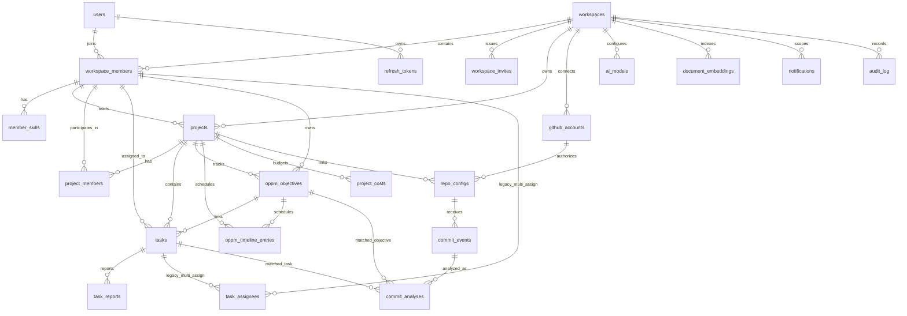

# ERD

Last updated: 2026-04-04

## Purpose

This ERD describes the current relational model defined in `shared/models/` and backed by the core Alembic migrations.

It is intentionally focused on the live model used by the codebase today. Where the schema contains a table that is not central to the active product flow, that is called out explicitly.

## Domain Groups

The schema is easiest to reason about in seven groups:

1. identity and auth
2. workspace and membership
3. project planning and execution
4. OPPM structures
5. GitHub integration and analysis
6. AI configuration and retrieval
7. notifications and audit

## Conceptual Relationship Diagram

## Core Tables

### Identity And Auth

| Table | Purpose | Key Fields |
|---|---|---|
| `users` | Local application users | `email`, `hashed_password`, `full_name`, `is_active`, `is_verified` |
| `refresh_tokens` | Refresh-token persistence | `user_id`, `token_hash`, `expires_at`, `revoked` |

Notes:

- access tokens are JWTs and are not stored in a table
- refresh tokens are stored as hashes, not raw tokens

### Workspace And Membership

| Table | Purpose | Key Fields |
|---|---|---|
| `workspaces` | Tenant boundary | `name`, `slug`, `plan`, `settings`, `created_by` |
| `workspace_members` | User membership in workspace | `workspace_id`, `user_id`, `role`, `display_name`, `avatar_url` |
| `workspace_invites` | Pending membership invitations | `workspace_id`, `email`, `role`, `token`, `expires_at`, `accepted_at` |
| `member_skills` | Skill matrix for team view | `workspace_member_id`, `skill_name`, `skill_level` |

Role and plan constraints:

- `workspaces.plan`: `free`, `pro`, `enterprise`
- `workspace_members.role`: `owner`, `admin`, `member`, `viewer`
- `workspace_invites.role`: `admin`, `member`, `viewer`
- `member_skills.skill_level`: `beginner`, `intermediate`, `expert`

### Projects And Execution

| Table | Purpose | Key Fields |
|---|---|---|
| `projects` | Top-level project record | `workspace_id`, `title`, `status`, `priority`, `progress`, `project_code`, `objective_summary`, `budget`, `planning_hours`, `lead_id` |
| `project_members` | Members assigned to a project | `project_id`, `member_id`, `role`, `joined_at` |
| `tasks` | Actionable work inside a project | `project_id`, `oppm_objective_id`, `assignee_id`, `status`, `priority`, `progress`, `project_contribution`, `due_date` |
| `task_reports` | Daily or periodic work log entries | `task_id`, `reporter_id`, `report_date`, `hours`, `is_approved`, `approved_by` |
| `task_assignees` | Historical multi-assignee table | `task_id`, `member_id` |

Project constraints:

- `projects.status`: `planning`, `in_progress`, `completed`, `on_hold`, `cancelled`
- `projects.priority`: `low`, `medium`, `high`, `critical`
- `project_members.role`: `lead`, `contributor`, `reviewer`, `observer`
- `tasks.status`: `todo`, `in_progress`, `completed`
- `tasks.priority`: `low`, `medium`, `high`, `critical`

Important live-model note:

- the current frontend and task API use `tasks.assignee_id` for assignment
- `task_assignees` still exists in schema and migration history, but it is not the active assignment path in the main UI flow

### OPPM Structures

| Table | Purpose | Key Fields |
|---|---|---|
| `oppm_objectives` | One Page Project Manager objectives | `project_id`, `title`, `owner_id`, `sort_order` |
| `oppm_timeline_entries` | Weekly timeline cells for objectives | `project_id`, `objective_id`, `week_start`, `status`, `ai_score`, `notes` |
| `project_costs` | Project budget tracking lines | `project_id`, `category`, `planned_amount`, `actual_amount`, `period` |

Timeline constraint:

- `oppm_timeline_entries.status`: `planned`, `in_progress`, `completed`, `at_risk`, `blocked`

Important live-model note:

- timeline is keyed by `week_start` as a real date, not a separate year/month grid model

### GitHub Integration And Analysis

| Table | Purpose | Key Fields |
|---|---|---|
| `github_accounts` | Stored GitHub account credentials per workspace | `workspace_id`, `account_name`, `github_username`, `encrypted_token` |
| `repo_configs` | Project-to-repository mapping | `repo_name`, `project_id`, `github_account_id`, `webhook_secret`, `is_active` |
| `commit_events` | Stored push commit metadata | `repo_config_id`, `commit_hash`, `commit_message`, `author_github_username`, `branch`, `files_changed`, `additions`, `deletions` |
| `commit_analyses` | AI analysis for a commit | `commit_event_id`, `ai_model`, `task_alignment_score`, `code_quality_score`, `progress_delta`, `matched_task_id`, `matched_objective_id` |

Important security note:

- `encrypted_token` and `webhook_secret` are sensitive and must never be returned to the frontend

### AI And Retrieval

| Table | Purpose | Key Fields |
|---|---|---|
| `ai_models` | Workspace-level AI provider configuration | `workspace_id`, `name`, `provider`, `model_id`, `endpoint_url`, `is_active` |
| `document_embeddings` | Vectorized retrieval corpus | `workspace_id`, `entity_type`, `entity_id`, `content`, `metadata`, `embedding` |

Provider constraint:

- `ai_models.provider`: `ollama`, `anthropic`, `openai`, `kimi`, `custom`

Important live-model note:

- `document_embeddings` is the main RAG storage table
- the unique key is `(entity_type, entity_id)`

### Notifications And Audit

| Table | Purpose | Key Fields |
|---|---|---|
| `notifications` | User-facing system notifications | `workspace_id`, `user_id`, `type`, `title`, `message`, `is_read`, `link`, `metadata` |
| `audit_log` | Change history and traceability | `workspace_id`, `user_id`, `action`, `entity_type`, `entity_id`, `old_data`, `new_data`, `ip_address` |

Notification types currently enforced:

- `info`
- `success`
- `warning`
- `error`
- `ai_analysis`
- `commit`
- `task_update`

## Relationship Notes That Matter In Code

### Workspace Membership Is The Central Join Point

Many features route through `workspace_members` rather than directly through `users`.

Examples:

- `projects.lead_id` points to `workspace_members.id`
- `project_members.member_id` points to `workspace_members.id`
- `tasks.assignee_id` points to `workspace_members.id`
- `oppm_objectives.owner_id` points to `workspace_members.id`
- `member_skills` is attached to workspace membership, not directly to the user

This is the correct model for a multi-tenant product where the same user can have different roles and display names across workspaces.

### Project Membership Uses Workspace Membership IDs

Project assignment is intentionally nested under workspace membership.

That means a project member is not just a user. It is a specific workspace member record with a role inside that workspace.

### Commit Analysis Bridges Git To Planning

`commit_analyses` is the bridge table from GitHub activity back into project execution.

It can point to:

- one matched task
- one matched objective
- AI-generated scoring and recommendations

### Audit And Retrieval Are Cross-Cutting

- `audit_log` is a cross-cutting trace table used by multiple features
- `document_embeddings` is also cross-cutting and indexes project, task, objective, and other workspace artifacts for AI retrieval

## Practical Modeling Caveats

These are the main areas to keep in mind when extending the schema:

- `task_assignees` exists, but the active task API flow uses the single `assignee_id` column
- project member create requests currently use a field named `user_id`, even though the stored relation is `project_members.member_id`
- some frontend types still lag behind the exact backend response names for workspace role fields

## Recommended Extension Rules

When adding new tables:

- use `workspace_id` for workspace-scoped data unless the table is truly user-scoped
- prefer `workspace_members.id` over `users.id` when the feature is role-sensitive inside a workspace
- add explicit check constraints for enum-like strings
- keep migrations in the core service migration chain
- update [API-REFERENCE.md](API-REFERENCE.md) and [TESTING-GUIDE.md](TESTING-GUIDE.md) with every schema-affecting change
