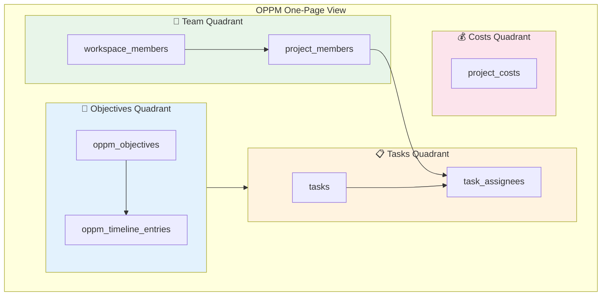

# OPPM AI — Entity Relationship Diagram

> **Schema version:** microservices architecture (20 tables)  
> **Auth:** Custom JWT tables (not Supabase Auth)  
> **Key change from v1:** `oppm_timeline_entries` uses `week_start DATE` (not `year/month INT`)

## Full Database ERD

```mermaid
erDiagram
    workspaces {
        uuid id PK
        text name
        text slug UK
        text description
        uuid created_by FK
        timestamptz created_at
        timestamptz updated_at
    }

    users {
        uuid id PK
        text email UK
        text password_hash
        text display_name
        boolean is_active
        boolean is_verified
        timestamptz created_at
        timestamptz updated_at
    }

    refresh_tokens {
        uuid id PK
        uuid user_id FK
        text token_hash UK
        timestamptz expires_at
        boolean revoked
        timestamptz created_at
    }

    email_verifications {
        uuid id PK
        uuid user_id FK
        text token UK
        timestamptz expires_at
        timestamptz used_at
        timestamptz created_at
    }

    workspace_members {
        uuid id PK
        uuid workspace_id FK
        uuid user_id FK
        text role "owner|admin|member|viewer"
        timestamptz joined_at
    }

    workspace_invites {
        uuid id PK
        uuid workspace_id FK
        text email
        text role
        uuid invited_by FK
        text token UK
        timestamptz expires_at
        timestamptz accepted_at
        timestamptz created_at
    }

    projects {
        uuid id PK
        uuid workspace_id FK
        text title
        text description
        text status "planning|in_progress|on_hold|completed|cancelled"
        text priority "low|medium|high|critical"
        integer progress "0-100"
        date start_date
        date deadline
        uuid lead_id FK
        jsonb metadata
        timestamptz created_at
        timestamptz updated_at
    }

    project_members {
        uuid id PK
        uuid project_id FK
        uuid workspace_member_id FK
        text role "lead|member|reviewer"
        timestamptz created_at
    }

    tasks {
        uuid id PK
        uuid project_id FK
        text title
        text description
        text status "todo|in_progress|review|done|blocked"
        text priority "low|medium|high|critical"
        integer progress "0-100"
        integer weight "1-10"
        uuid assignee_id FK
        uuid oppm_objective_id FK
        date due_date
        timestamptz created_at
        timestamptz updated_at
    }

    task_assignees {
        uuid id PK
        uuid task_id FK
        uuid workspace_member_id FK
        timestamptz assigned_at
    }

    oppm_objectives {
        uuid id PK
        uuid project_id FK
        text title
        text description
        uuid owner_id FK
        uuid aligned_task_id FK
        integer sort_order
        timestamptz created_at
    }

    oppm_timeline_entries {
        uuid id PK
        uuid objective_id FK
        uuid project_id FK
        date week_start "Monday of the week (YYYY-MM-DD)"
        text status "planned|in_progress|completed|at_risk|blocked"
        float ai_score "0.0-1.0 optional"
        text notes
        timestamptz created_at
    }

    document_embeddings {
        uuid id PK
        uuid workspace_id FK
        text entity_type "project|objective|task|commit"
        uuid entity_id FK
        text content
        vector embedding "1536-dim pgvector"
        timestamptz created_at
    }

    project_costs {
        uuid id PK
        uuid project_id FK
        text category
        text description
        numeric planned_amount
        numeric actual_amount
        text currency
        timestamptz created_at
        timestamptz updated_at
    }

    github_accounts {
        uuid id PK
        uuid workspace_id FK
        text account_name
        text github_username
        text encrypted_token
        timestamptz created_at
    }

    repo_configs {
        uuid id PK
        text repo_name
        uuid project_id FK
        uuid github_account_id FK
        text webhook_secret
        boolean is_active
        timestamptz created_at
    }

    commit_events {
        uuid id PK
        uuid repo_config_id FK
        text commit_hash
        text commit_message
        text author
        text branch
        integer files_changed
        integer additions
        integer deletions
        timestamptz pushed_at
        timestamptz created_at
    }

    commit_analyses {
        uuid id PK
        uuid commit_event_id FK
        text ai_model
        integer quality_score "0-100"
        integer alignment_score "0-100"
        integer progress_delta
        text summary
        jsonb quality_flags
        jsonb suggestions
        timestamptz created_at
    }

    ai_models {
        uuid id PK
        uuid workspace_id FK
        text name
        text provider "ollama|kimi|anthropic|openai"
        text model_id
        text endpoint_url
        text api_key
        boolean is_active
        timestamptz created_at
    }

    notifications {
        uuid id PK
        uuid workspace_id FK
        uuid user_id FK
        text type
        text title
        text message
        boolean is_read
        text link
        jsonb metadata
        timestamptz created_at
    }

    audit_log {
        uuid id PK
        uuid workspace_id FK
        uuid user_id FK
        text action
        text entity_type
        uuid entity_id
        jsonb old_data
        jsonb new_data
        text ip_address
        timestamptz created_at
    }

    workspaces ||--o{ workspace_members : "has members"
    workspaces ||--o{ workspace_invites : "has invites"
    workspaces ||--o{ projects : "contains"
    workspaces ||--o{ github_accounts : "owns"
    workspaces ||--o{ ai_models : "configures"
    workspaces ||--o{ notifications : "generates"
    workspaces ||--o{ audit_log : "tracks"
    workspaces ||--o{ document_embeddings : "indexes"

    users ||--o{ workspace_members : "belongs to"
    users ||--o{ refresh_tokens : "holds"
    users ||--o{ email_verifications : "verifies via"

    projects ||--o{ project_members : "has team"
    projects ||--o{ tasks : "contains"
    projects ||--o{ oppm_objectives : "defines"
    projects ||--o{ project_costs : "budgets"
    projects ||--o{ oppm_timeline_entries : "schedules"

    workspace_members ||--o{ project_members : "assigned to"
    workspace_members ||--o{ task_assignees : "assigned"

    tasks ||--o{ task_assignees : "assigned to"
    oppm_objectives ||--o{ oppm_timeline_entries : "scheduled"
    oppm_objectives ||--o{ tasks : "aligns"

    github_accounts ||--o{ repo_configs : "manages"
    projects ||--o{ repo_configs : "linked to"
    repo_configs ||--o{ commit_events : "receives"
    commit_events ||--o{ commit_analyses : "analyzed by"
```

## OPPM Quadrant Mapping

The database schema maps directly to the four quadrants of the One Page Project Manager:

