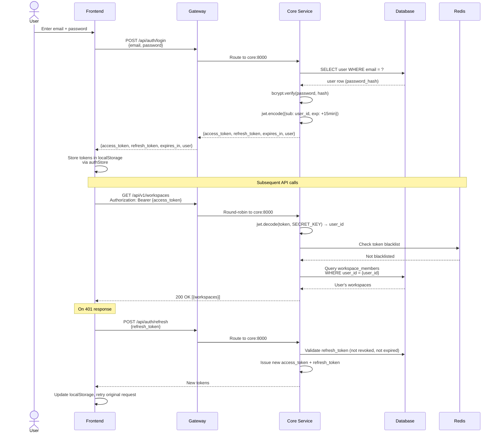
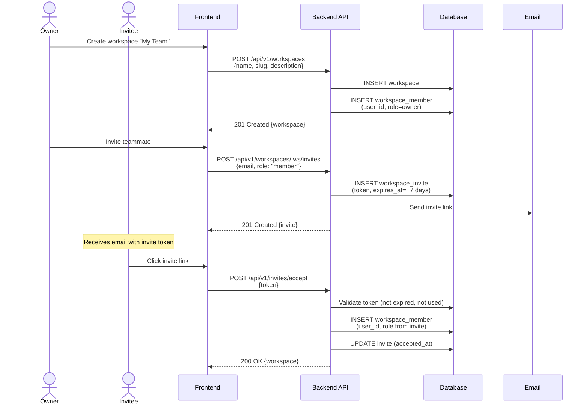
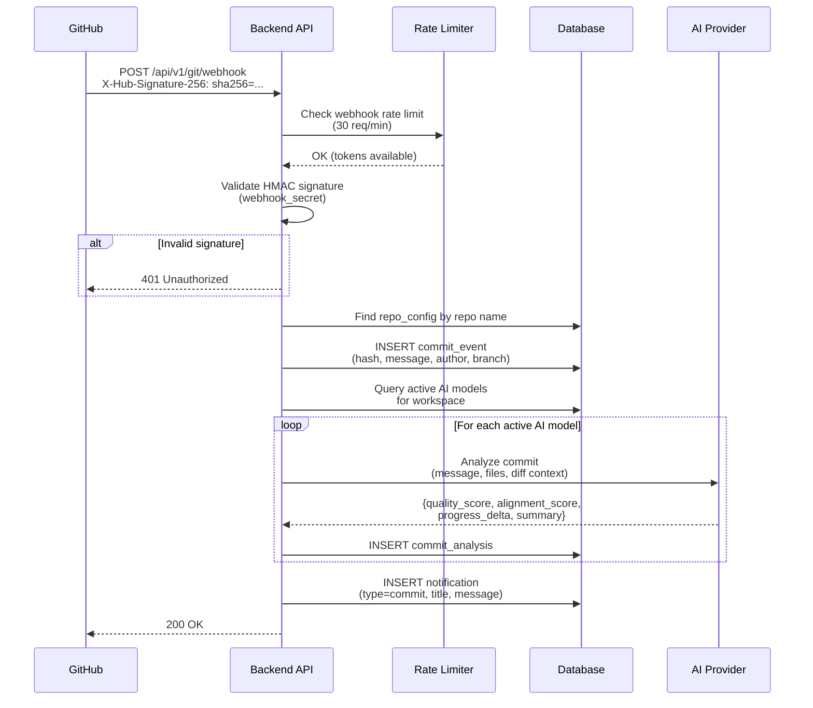
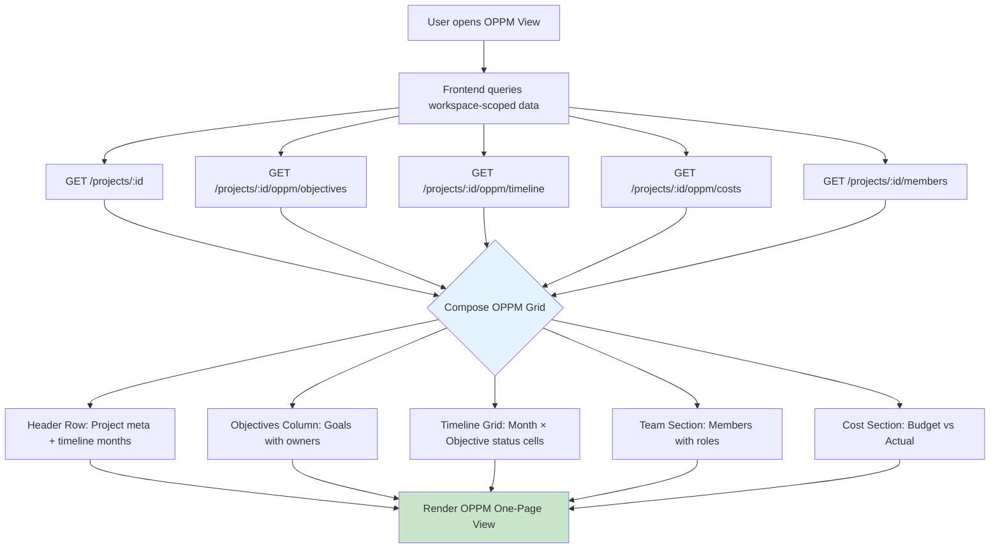
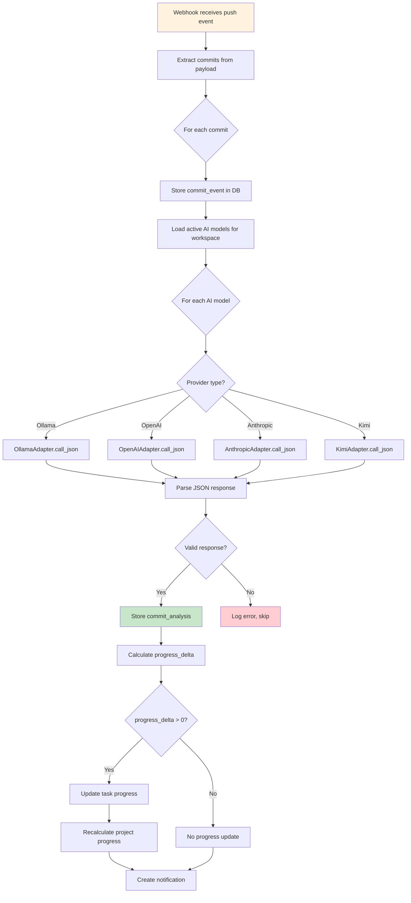
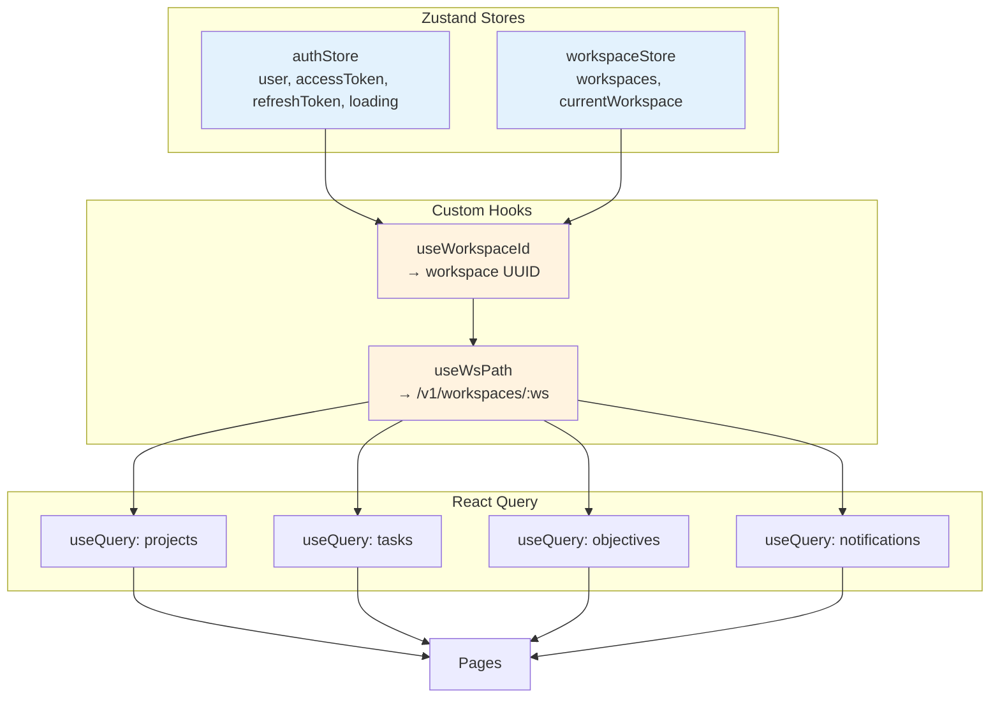

# OPPM AI — System Flowcharts

## 1. Authentication Flow



## 2. Workspace Creation & Invite Flow



## 3. GitHub Webhook Flow



## 4. OPPM Dashboard Data Flow



## 5. AI Commit Analysis Flow



## 6. Multi-Tenant Data Isolation

```mermaid
flowchart TD
    A[API Request] --> B[Validate token via<br/>jwt.decode(token, SECRET_KEY) → user_id]
    B --> C[Extract workspace_id from URL path]
    C --> D{Is user a member<br/>of this workspace?}

    D -->|No| E[403 Forbidden]
    D -->|Yes| F[Determine user role in workspace]

    F --> G{Required permission?}

    G -->|Read| H[Allow - all members can read]
    G -->|Write| I{Role >= member?}
    G -->|Admin| J{Role >= admin?}
    G -->|Owner| K{Role == owner?}

    I -->|No| E
    I -->|Yes| L[Allow operation]

    J -->|No| E
    J -->|Yes| L

    K -->|No| E
    K -->|Yes| L

    L --> M[Execute with workspace_id filter]
    M --> N[workspace_id filter enforced<br/>at repository layer]

    style E fill:#ffcdd2
    style L fill:#c8e6c9
    style N fill:#e3f2fd
```

## 7. Frontend State Management


