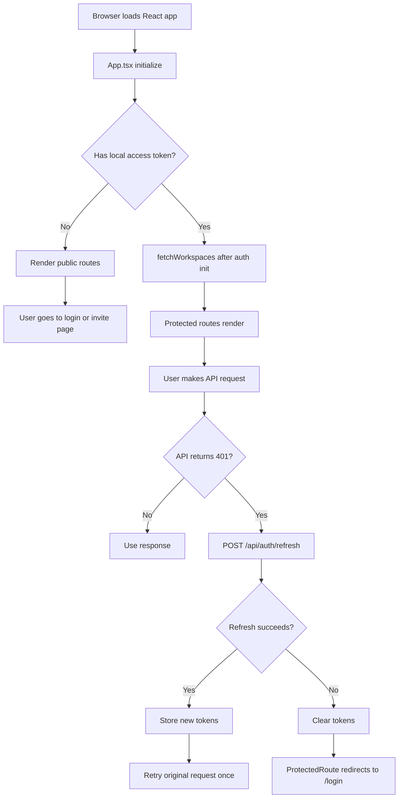
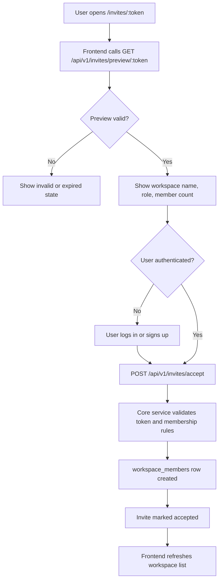
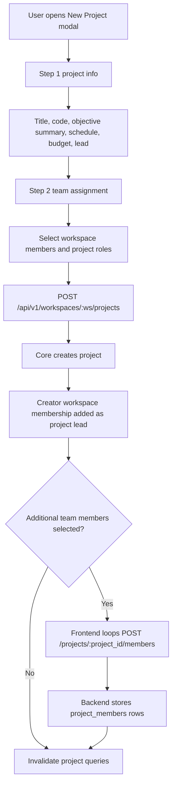
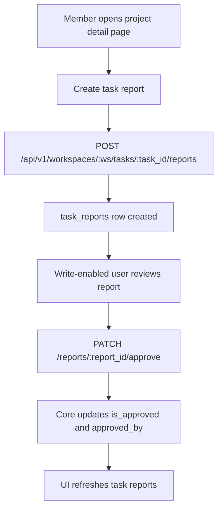
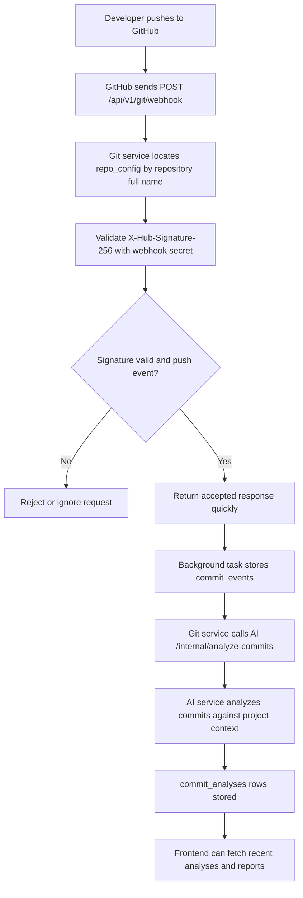
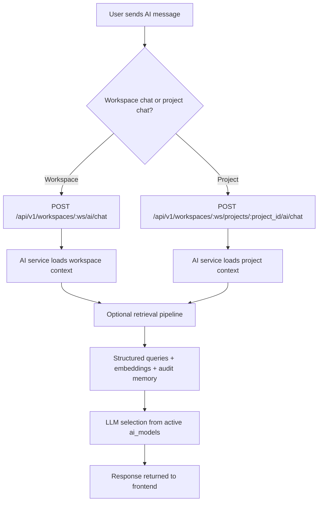
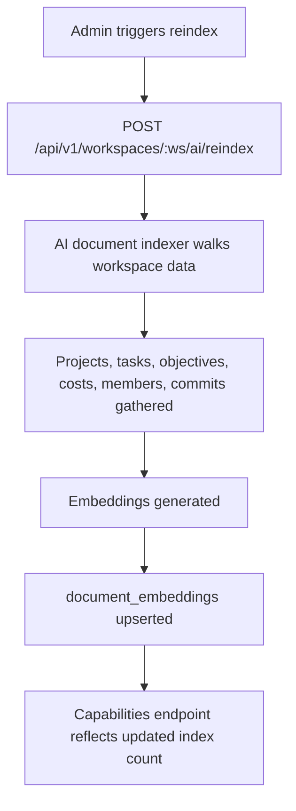
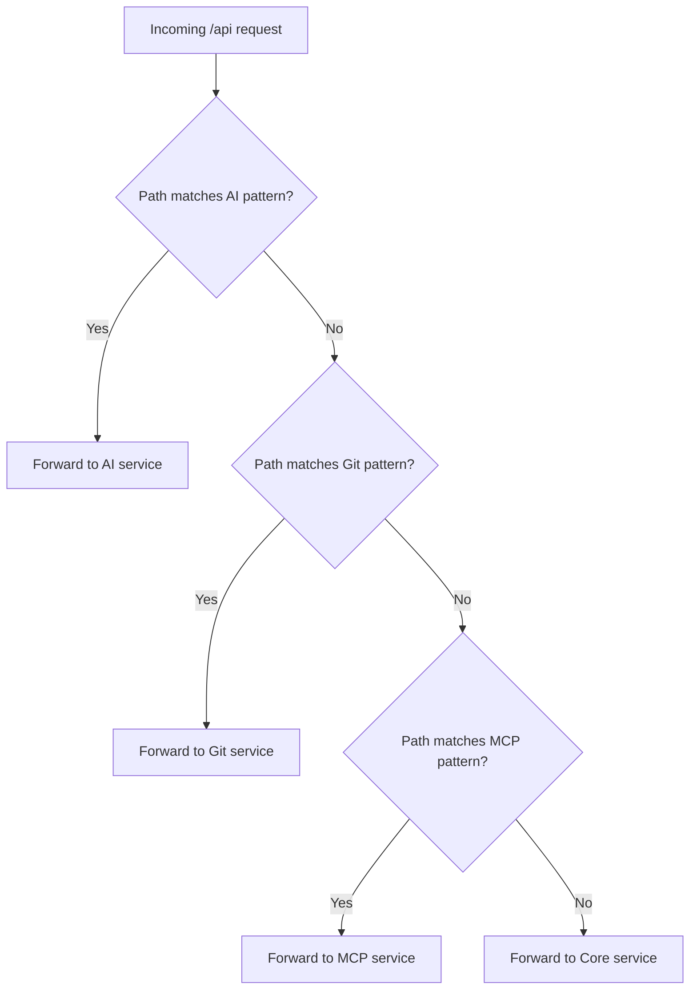

# Flowcharts

Last updated: 2026-04-06

## Purpose

These flowcharts describe the major runtime paths in the current implementation.

They are intentionally based on the code paths that exist now, not on older architecture plans.

## 1. App Bootstrap And Auth Refresh

## 2. Workspace Invite Acceptance

## 3. Project Creation Wizard

## 4. Task Report Approval Flow

## 5. GitHub Webhook To Commit Analysis

## 6. AI Chat And RAG Retrieval

## 7. Workspace Reindex Flow

## 8. Gateway Routing Decision

## Notes

- Native development uses the Python gateway in `services/gateway/`.
- Docker deployments use nginx rules in `gateway/nginx.conf`.
- Those routing rules must stay aligned.
- The internal AI analysis route is not part of the public frontend API surface.
