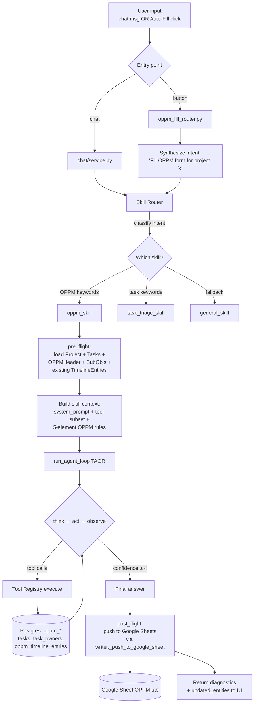

# OPPM Agent — Skills System & Data Pipeline

> **Status:** Design proposal. Nothing in this document is implemented yet.
> **Goal:** Replace the single-purpose `fill_oppm` LLM call with a skill-aware agent that can populate the entire OPPM form (timeline statuses, sub-objective links, owners, risks, costs, …) and route to the right specialist when the user touches a particular domain.

---

## 1. Why this exists

Today, two AI surfaces live in this codebase:

- **Auto Fill button** → `fill_oppm` → one LLM call that only generates 3 text fields (`project_objective`, `deliverable_output`, `completed_by_text`). Everything else is read straight from the DB ([oppm_fill_service.py:349-375](../../services/intelligence/domains/analysis/oppm_fill_service.py#L349-L375)).
- **Chat assistant** → TAOR loop ([agent_loop.py](../../services/intelligence/infrastructure/rag/agent_loop.py)) → has tools for OPPM, tasks, projects, costs — but no awareness that "this user is asking me to fill an OPPM" vs "this user is asking me about commits."

The user-visible result: timeline dots all show ◻ (planned) because `OPPMTimelineEntry.status` defaults to `"planned"` and nothing ever updates it; risks/costs/forecasts are blank because no code reads those tables.

This document proposes a **skill-based agent** that wraps the existing TAOR loop, plus a concrete "OPPM skill" that owns the auto-fill workflow end-to-end.

---

## 2. What "OPPM" actually means (research)

OPPM (One-Page Project Manager) is Clark Campbell's methodology for compressing a whole project onto a single page ([MPUG overview](https://mpug.com/the-one-page-project-manager), [Campbell book](https://books.google.com/books/about/The_New_One_Page_Project_Manager.html?id=YD5XZ_Ag1WIC)). The methodology defines **five essential elements** that must appear on every OPPM:

1. **Tasks** — major work items (template caps at ~30)
2. **Objectives** — strategic goals each task contributes to (the A–F lettered milestone rows)
3. **Timeline** — week-by-week date grid with dot markers per task
4. **Owners** — A/B/C priority letters mapping people to tasks
5. **Costs** — bar charts in the bottom-right quadrant

Plus two cross-cutting concerns: **Risk** (the bottom rows in your template) and **Quality** (color of the dots — Green/Yellow/Red).

OPPMI publishes three template flavours ([oppmi.com download page](https://oppmi.com/download-project-manager.cfm)):

| Flavour | What's different | Source |
|---|---|---|
| **Traditional** | Standard 5-element matrix; task-driven with hierarchical sub-objectives | Campbell, *New OPPM* |
| **PMO** | Adds portfolio rollup; multi-project view | OPPMI PMO template |
| **Agile** | Replaces "objectives + sub-objectives" with **vision + feature sets**; adds **Scrum Master** role ([agile chapter](https://www.oreilly.com/library/view/the-new-one-page/9781118461136/9781118461136c8.xhtml)) | Campbell, *New OPPM*, ch. 8 |

**Implication for the agent:** the OPPM skill should be aware of which flavour a project uses (default Traditional). The data model is identical (the same DB tables back all three), but the *prompt context* and *labelling* differ.

---

## 3. Current architecture (what to build on)

```
┌────────────────────────────────────────────────────────────────┐
│  CHAT ASSISTANT path                                            │
│  ──────────────────────────────                                 │
│  User msg ─► chat/service.py ─► run_agent_loop() ─► TAOR ─► reply
│                                       │                         │
│                                       ▼                         │
│                               ToolRegistry (oppm/task/cost/…)   │
└────────────────────────────────────────────────────────────────┘

┌────────────────────────────────────────────────────────────────┐
│  AUTO-FILL BUTTON path                                          │
│  ────────────────────────                                       │
│  Click ─► oppm_fill_router ─► fill_oppm() ─► ONE LLM call ─► DB │
│                                  (3 text fields only)           │
└────────────────────────────────────────────────────────────────┘
```

What's already good (don't rebuild):
- **`ToolRegistry`** ([registry.py](../../services/intelligence/infrastructure/tools/registry.py)) already groups tools by `category`. A "skill" can map to one or more categories.
- **TAOR loop** is solid (Think → Act → Observe → Retry with confidence, dedup, RAG re-query).
- **Tool schema generation** for OpenAI / Anthropic / prompt-text already works.

What's missing:
- No concept of a **skill** (a bundle of: triggers + domain prompt + tool subset + output contract).
- No **router** step that picks a skill before entering TAOR.
- No tools for: sub-objectives, task-owner assignment, risks, costs, forecasts, OPPM header upserts, sheet push.

---

## 4. Proposed: the Skill system

### 4.1 What a skill is

A **skill** is a reusable bundle the agent can activate when it recognises a domain. Concrete shape:

```python
@dataclass
class Skill:
    name: str                    # "oppm", "task_triage", "cost_review", …
    description: str             # one-liner shown to the router LLM
    triggers: list[str]          # keywords / regex that suggest this skill
    intent_examples: list[str]   # few-shot examples for the router
    tool_categories: list[str]   # which ToolRegistry categories to expose
    extra_tools: list[str]       # specific tool names to include beyond categories
    system_prompt: str           # injected as system message when active
    output_contract: dict | None # optional JSON schema for the final answer
    pre_flight: Callable | None  # async hook: gather context before TAOR
    post_flight: Callable | None # async hook: e.g. push OPPM to Sheets after writes
```

A skill is **not** a separate agent — it's a *configuration* the existing TAOR loop runs under. Same loop, different prompt + different tool subset + different post-flight side effects.

### 4.2 Why skills (vs. just dumping all tools to the LLM)

| Without skills | With skills |
|---|---|
| Every chat turn ships all ~25 tools to the model. Token cost grows with every new tool. | Only the skill's tools ship. ~5 tools per turn. |
| Model sometimes uses `create_objective` when the user asked about commits. | Router commits to one domain per turn; wrong-tool calls disappear. |
| The auto-fill button uses a totally different code path (`fill_oppm`) and doesn't benefit from new tools added to the registry. | Auto fill *is* "invoke the OPPM skill with intent=fill_form". One code path. |
| Adding Agile / PMO variants means forking `fill_oppm`. | Add a new skill; share infrastructure. |

### 4.3 Where skills live in code

Proposed layout (none of this exists yet):

```
services/intelligence/
├── domains/
│   └── chat/service.py                        # existing — add skill router call
├── infrastructure/
│   ├── rag/agent_loop.py                      # existing — accepts SkillContext
│   ├── tools/                                 # existing tool modules
│   └── skills/                                # NEW
│       ├── base.py                            # Skill, SkillContext, SkillRegistry
│       ├── router.py                          # pick_skill(user_msg, history) → Skill
│       ├── oppm_skill.py                      # the OPPM specialist (see §6)
│       ├── task_triage_skill.py               # placeholder for future
│       └── general_skill.py                   # fallback: full tool registry, no specialism
```

---

## 5. The full data pipeline (proposed)

### 5.1 Flow chart



### 5.2 Stage-by-stage

| Stage | What happens | Input | Output | Owner |
|---|---|---|---|---|
| **1. Entry** | Chat msg or Auto-Fill click arrives. Auto-Fill synthesises a fixed intent string ("Fill the OPPM form for project {id}"). | HTTP request | Normalised user intent | `oppm_fill_router.py` / `chat/service.py` |
| **2. Skill router** | A small LLM call (or rule-based first pass) picks which skill to activate based on the intent + recent messages. | Intent text + history | `Skill` instance | `skills/router.py` (NEW) |
| **3. Pre-flight** | The skill loads the data it needs (project, tasks, header, sub-objectives, members, existing timeline entries) and stuffs it into the prompt context — so the TAOR loop doesn't waste tool calls on reads it could have batched. | `(session, project_id, workspace_id)` | `dict` of pre-loaded data | `Skill.pre_flight` |
| **4. TAOR loop** | Existing `run_agent_loop`. Receives the skill's `system_prompt`, the **filtered tool list**, and the pre-loaded data. Runs Think→Act→Observe→Retry until confident. | Pre-flight data + skill config | `AgentLoopResult` | `agent_loop.py` (existing) |
| **5. Tool execution** | Tools in the skill's category run, mutating Postgres. For OPPM: `set_task_owner`, `bulk_set_timeline`, `link_task_sub_objective`, `upsert_risk`, etc. | Tool name + input | `ToolResult` + `updated_entities` | `tools/*.py` |
| **6. Post-flight** | The skill performs side effects after a successful run. For OPPM: push to Google Sheets via the existing writer. For task_triage: send notifications. | `AgentLoopResult` + skill state | side-effect result | `Skill.post_flight` |
| **7. Response** | Returns diagnostics + `updated_entities` to the UI so React Query can invalidate the right caches. | `AgentLoopResult` + post-flight | HTTP response | router |

### 5.3 Data model touch-points

What an OPPM-skill run touches (read = R, write = W):

| Table | R/W | Why |
|---|---|---|
| `projects` | R | name, lead, dates |
| `project_members`, `workspace_members`, `users` | R | owner column population |
| `tasks` | R | major task list, current status |
| `task_owners` | R/W | A/B/C priority letters |
| `oppm_objectives` | R/W | strategic goals |
| `oppm_sub_objectives` | R/W | A–F lettered milestone rows |
| `task_sub_objectives` | R/W | ✓ marks linking tasks to A–F |
| `oppm_timeline_entries` | R/W | week-by-week status (drives ◻/●/■) |
| `oppm_header` | R/W | project_objective, deliverable_output, completed_by_text |
| `project_costs` | R/W | costs quadrant of X-diagram (currently unused) |
| `oppm_risks` | R/W | risk rows at bottom of template (currently unused) |
| `oppm_forecasts` | R/W | summary & forecast quadrant (currently unused) |

Italics = not currently read or written by any code.

---

## 6. The OPPM skill (concrete spec)

### 6.1 Skill manifest

```python
# services/intelligence/infrastructure/skills/oppm_skill.py
OPPM_SKILL = Skill(
    name="oppm",
    description="Fills, updates, and reasons about One-Page Project Manager forms.",
    triggers=[
        # case-insensitive substring or regex
        "oppm", "one-page", "fill the form", "auto fill",
        "timeline status", "sub-objective", "milestone",
        "owner / priority", "completed by",
        "risk row", "forecast",
    ],
    intent_examples=[
        "Fill out the OPPM for project X",
        "Update the timeline status for task Y to in_progress this week",
        "Add a sub-objective 'Security & Auth' as letter A",
        "Set Bob as primary owner of task 5",
    ],
    tool_categories=["oppm", "task", "cost", "read"],
    extra_tools=["push_oppm_to_sheet"],   # crosses service boundary; see §6.4
    system_prompt=_OPPM_SYSTEM_PROMPT,    # see §6.2
    output_contract=None,                  # free-form chat reply; structured side effects via tools
    pre_flight=oppm_preflight,             # see §6.3
    post_flight=oppm_postflight,           # see §6.4
)
```

### 6.2 System prompt (the skill's "knowledge")

```text
You are the OPPM specialist. You know the One-Page Project Manager methodology
by Clark Campbell — five elements (Tasks, Objectives, Timeline, Owners, Costs)
plus Risk and Quality.

When asked to FILL or UPDATE an OPPM, follow this priority order:
  1. Generate any missing header text via your reasoning (project_objective,
     deliverable_output, completed_by_text). Keep each under 120 chars.
  2. For each task in the project: derive timeline status per week. Use:
       - Task.status = "todo"        → "planned"     (◻)
       - Task.status = "in_progress" → "in_progress" (●)
       - Task.status = "done"        → "completed"   (■)
       - Task overdue + not done     → "at_risk"     (▲)
       - Task with blocker dependency→ "blocked"     (✕)
     Call bulk_set_timeline once per project, not per task.
  3. Link each task to the sub-objectives it contributes to (max 6, A–F).
  4. Assign owners + priority letters: A=primary, B=primary helper, C=secondary.
  5. Populate risks if Project.notes mentions any risk language.
  6. NEVER invent dates, names, or task titles not present in the input data.

When asked about an existing OPPM, READ first (search_tasks, get_project) before
proposing changes.

Variant awareness: if Project.metadata.oppm_variant == "agile", use vision/feature
language instead of objective/sub-objective. Default to Traditional otherwise.
```

### 6.3 Pre-flight: bulk-load to avoid tool-call thrash

```python
async def oppm_preflight(session, project_id, workspace_id):
    # One round-trip per table; the loop then has everything in context
    return {
        "project":        await ProjectRepository(session).get(project_id),
        "header":         await OPPMHeaderRepository(session).get(project_id),
        "tasks":          await TaskRepository(session).list_for_project(project_id),
        "task_owners":    await TaskOwnerRepository(session).list_for_project(project_id),
        "sub_objectives": await SubObjectiveRepository(session).list_for_project(project_id),
        "members":        await WorkspaceMemberRepository(session).list_for_workspace(workspace_id),
        "timeline":       await TimelineRepository(session).list_for_project(project_id),
        "today":          date.today().isoformat(),
    }
```

This is shoved into the first user message as a `## Project Snapshot` block so the LLM doesn't waste calls re-reading what we already know.

### 6.4 Post-flight: push to Sheets

```python
async def oppm_postflight(session, project_id, workspace_id, agent_result):
    if "oppm_timeline_entries" in agent_result.updated_entities or \
       "oppm_header" in agent_result.updated_entities or \
       "task_owners" in agent_result.updated_entities:
        return await google_sheets_service.push_project_to_sheet(
            session, project_id, workspace_id
        )
    return None
```

This is the existing [`_push_to_google_sheet`](../../services/workspace/domains/oppm/google_sheets/writer.py#L1040-L1114) — wrapped, not duplicated. The agent doesn't need to know about A1 notation; the post-flight bridges to the workspace service.

### 6.5 New tools the OPPM skill needs (currently missing)

| Tool | Purpose | Repository it wraps |
|---|---|---|
| `upsert_oppm_header` | Set project_objective / deliverable_output / completed_by_text | `OPPMHeaderRepository` (exists) |
| `create_sub_objective` | Add an A–F lettered milestone | `SubObjectiveRepository` (exists) |
| `link_task_sub_objective` | Add ✓ mark linking task → sub-objective position 1-6 | `TaskSubObjectiveRepository` (exists) |
| `set_task_owner` | Assign A/B/C priority for member on task | `TaskOwnerRepository` (exists) |
| `upsert_risk` | Populate Risk 1–4 rows | `OPPMRiskRepository` (exists, unused) |
| `upsert_cost` | Populate Costs quadrant | `ProjectCostRepository` (exists, unused) |
| `upsert_forecast` | Populate Summary & Forecast quadrant | `OPPMForecastRepository` (exists, unused) |
| `push_oppm_to_sheet` | Trigger the writer | wraps `google_sheets/writer.py` |

All of these are thin wrappers around repositories that already exist; the only "new code" is the `ToolDefinition.register(...)` call and the handler.

---

## 7. The skill router

### 7.1 Two-stage routing

**Stage A — rule-based fast path** (no LLM call):
- If the entry point is the Auto-Fill button → always pick `oppm_skill`. No LLM needed.
- If the user message contains 2+ trigger keywords from a single skill's `triggers` list → pick that skill.

**Stage B — LLM classifier** (only if Stage A is ambiguous):
- One small LLM call (~50 tokens out) returning `{"skill": "oppm", "confidence": 0.9}`.
- If confidence < 0.6 → pick `general_skill` (full tool registry, no specialism).

### 7.2 Why two stages

The Auto-Fill case is 100% deterministic — wasting an LLM call on routing it would be silly. The chat case sometimes needs the model's judgment ("update the dots in the form" doesn't contain the word "OPPM" but clearly means it).

---

## 8. Migration path (low-risk)

Build it in three steps without breaking either existing surface:

1. **Step 1 — Skill scaffolding**, no behaviour change
   - Add `skills/base.py` with `Skill`, `SkillRegistry`, `SkillContext`.
   - Add `general_skill` that exposes the full tool registry (i.e. today's behaviour).
   - Wire `chat/service.py` to call `pick_skill()` → currently always returns `general_skill`.
   - Verify chat still works identically.

2. **Step 2 — OPPM skill, parallel path**
   - Add `oppm_skill.py` with the spec from §6.
   - Add the missing tools (§6.5).
   - Add `pick_skill()` rule for Auto-Fill button → `oppm_skill`.
   - Keep the *legacy* `fill_oppm` function untouched. Add a new endpoint `/oppm/agent-fill` that uses the skill.
   - A/B test by flipping a feature flag in the frontend.

3. **Step 3 — Cutover**
   - Frontend Auto-Fill button calls `/oppm/agent-fill`.
   - Delete the LLM call inside legacy `fill_oppm`; keep its DB-load helpers (the agent skill reuses them via pre_flight).

No flag flips during dev — the new path is additive until step 3.

---

## 9. Open questions (decide before implementing)

1. **Variant detection** — Where do we store `oppm_variant` (traditional / pmo / agile)? Suggest adding a column on `projects` or `oppm_headers`. Default = `traditional`.
2. **Routing model** — Use the workspace's default LLM for the router, or hard-pin to `gemma4:31b-cloud` for predictability?
3. **Per-tool authorization** — `set_task_owner` writes to `task_owners`. Should we require `require_write` workspace role inside the tool, or trust the chat endpoint's middleware? Existing pattern is to trust the endpoint.
4. **Cross-service push** — `oppm_postflight` calls `services/workspace/...` from `services/intelligence/...`. Should this go through an HTTP call, an internal API, or a direct import? Other tools in this repo use direct imports; staying consistent unless we want to enforce hard service boundaries.
5. **Idempotency** — If the user clicks Auto-Fill twice, the second call should be a no-op for unchanged fields. The agent already handles this naturally because tools like `bulk_set_timeline` are upserts, but worth confirming.

---

## 10. References

Background reading I drew from:

- [The One-Page Project Manager — MPUG overview](https://mpug.com/the-one-page-project-manager) — explains the 5 elements + matrix structure.
- [The New One-Page Project Manager (Campbell, 2nd ed.) — book entry](https://books.google.com/books/about/The_New_One_Page_Project_Manager.html?id=YD5XZ_Ag1WIC) — definitive source on Traditional / PMO / Agile variants.
- [Chapter 8 — 12 Construction Steps for an Agile OPPM](https://www.oreilly.com/library/view/the-new-one-page/9781118461136/9781118461136c8.xhtml) — Agile-specific structure (vision/feature sets, Scrum Master).
- [OPPMI download page](https://oppmi.com/download-project-manager.cfm) — official template variants.
- [PMRGI book review](https://www.pmrgi.com/blog/the-one-page-project-manager) — practitioner perspective.
- [Traditional vs Agile PMO comparison](https://pmoglobalinstitute.org/traditional-pmo-vs-agile-pmo/) — context for the PMO variant.

Existing code touched by this design:

- [services/intelligence/infrastructure/rag/agent_loop.py](../../services/intelligence/infrastructure/rag/agent_loop.py) — TAOR loop (reused as-is, accepts skill context)
- [services/intelligence/infrastructure/tools/registry.py](../../services/intelligence/infrastructure/tools/registry.py) — tool registry (reused)
- [services/intelligence/infrastructure/tools/oppm_tools.py](../../services/intelligence/infrastructure/tools/oppm_tools.py) — base for new tools
- [services/intelligence/domains/analysis/oppm_fill_service.py](../../services/intelligence/domains/analysis/oppm_fill_service.py) — DB-load helpers reused in pre-flight
- [services/workspace/domains/oppm/google_sheets/writer.py](../../services/workspace/domains/oppm/google_sheets/writer.py) — wrapped by post-flight
