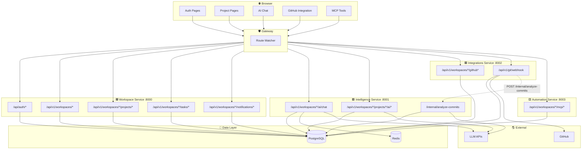

# API Pipeline & Interaction Flow — Miro Ready

Last updated: 2026-05-01

## Purpose

This document maps **how every public API interacts with other APIs** across the four backend services.

Use it to:
- Draw interaction diagrams in Miro
- Understand cross-service call chains
- Identify which endpoints trigger side effects in other services

---

## Legend

| Symbol | Meaning |
|---|---|
| `→` | HTTP request (public or internal) |
| `⇢` | Internal service-to-service call |
| `↻` | Async / background task |
| `🟦` | Workspace Service |
| `🟩` | Intelligence Service |
| `🟥` | Integrations Service |
| `🟨` | Automation Service |

---

## 1. Authentication Flows

### 1.1 Sign Up
```
Browser → POST /api/auth/signup
    🟦 Workspace Service
        → INSERT users
        → INSERT refresh_tokens
        → RETURN { access_token, refresh_token, user }
```

### 1.2 Log In
```
Browser → POST /api/auth/login
    🟦 Workspace Service
        → SELECT users (by email)
        → VERIFY bcrypt password
        → INSERT refresh_tokens
        → RETURN { access_token, refresh_token, user }
```

### 1.3 Token Refresh
```
Browser → POST /api/auth/refresh
    🟦 Workspace Service
        → SELECT refresh_tokens (by token_hash)
        → VERIFY not expired
        → GENERATE new access_token
        → RETURN { access_token, refresh_token }
```

### 1.4 Get Current User
```
Browser → GET /api/auth/me
    🟦 Workspace Service
        → DECODE JWT (shared/auth.py)
        → SELECT users
        → RETURN user profile
```

### 1.5 Sign Out
```
Browser → POST /api/auth/signout
    🟦 Workspace Service
        → INVALIDATE refresh_tokens
        → RETURN { ok: true }
```

---

## 2. Workspace & Member Flows

### 2.1 Create Workspace
```
Browser → POST /api/v1/workspaces
    🟦 Workspace Service
        → INSERT workspaces
        → INSERT workspace_members (creator as owner)
        → RETURN workspace
```

### 2.2 List Workspaces
```
Browser → GET /api/v1/workspaces
    🟦 Workspace Service
        → SELECT workspace_members (for current user)
        → JOIN workspaces
        → RETURN workspace list + current_user_role
```

### 2.3 Invite Member
```
Browser → POST /api/v1/workspaces/{ws}/invites
    🟦 Workspace Service
        → INSERT workspace_invites
        → SEND email (infrastructure/email.py)
        → RETURN invite
```

### 2.4 Preview Invite (Public)
```
Browser → GET /api/v1/invites/preview/{token}
    🟦 Workspace Service (no auth required)
        → SELECT workspace_invites (by token)
        → JOIN workspaces
        → RETURN preview metadata
```

### 2.5 Accept Invite
```
Browser → POST /api/v1/invites/accept
    🟦 Workspace Service
        → VERIFY token
        → INSERT workspace_members
        → UPDATE workspace_invites (accepted)
        → RETURN workspace
```

### 2.6 Update Member Role
```
Browser → PUT /api/v1/workspaces/{ws}/members/{id}
    🟦 Workspace Service
        → VERIFY admin role
        → UPDATE workspace_members.role
        → RETURN updated member
```

---

## 3. Project Flows

### 3.1 Create Project
```
Browser → POST /api/v1/workspaces/{ws}/projects
    🟦 Workspace Service
        → VERIFY write role
        → INSERT projects
        → INSERT project_members (creator as lead)
        → RETURN project
```

### 3.2 List Projects
```
Browser → GET /api/v1/workspaces/{ws}/projects?page=&page_size=
    🟦 Workspace Service
        → SELECT projects (by workspace_id)
        → RETURN { items, total }
```

### 3.3 Get Project Detail
```
Browser → GET /api/v1/workspaces/{ws}/projects/{id}
    🟦 Workspace Service
        → SELECT projects
        → JOIN project_members + workspace_members
        → RETURN project with team
```

### 3.4 Add Project Member
```
Browser → POST /api/v1/workspaces/{ws}/projects/{id}/members
    🟦 Workspace Service
        → VERIFY write role
        → INSERT project_members
        → RETURN member
```

### 3.5 Update Project
```
Browser → PUT /api/v1/workspaces/{ws}/projects/{id}
    🟦 Workspace Service
        → VERIFY write role
        → UPDATE projects
        → RETURN updated project
```

### 3.6 Delete Project
```
Browser → DELETE /api/v1/workspaces/{ws}/projects/{id}
    🟦 Workspace Service
        → VERIFY write role
        → DELETE projects (CASCADE: tasks, objectives, costs, etc.)
        → RETURN { ok: true }
```

---

## 4. Task Flows

### 4.1 Create Task
```
Browser → POST /api/v1/workspaces/{ws}/tasks
    🟦 Workspace Service
        → VERIFY write role + project lead check
        → INSERT tasks
        → RETURN task
```

### 4.2 List Tasks
```
Browser → GET /api/v1/workspaces/{ws}/tasks?project_id=&status=
    🟦 Workspace Service
        → SELECT tasks (by workspace_id + filters)
        → RETURN { items, total }
```

### 4.3 Submit Task Report
```
Browser → POST /api/v1/workspaces/{ws}/tasks/{id}/reports
    🟦 Workspace Service
        → VERIFY assignee match
        → INSERT task_reports
        → RETURN report
```

### 4.4 Approve Task Report
```
Browser → PATCH /api/v1/workspaces/{ws}/tasks/{id}/reports/{rid}/approve
    🟦 Workspace Service
        → VERIFY write role + project lead check
        → UPDATE task_reports (is_approved, approved_by)
        → RETURN updated report
```

---

## 5. OPPM Flows

### 5.1 Create Objective
```
Browser → POST /api/v1/workspaces/{ws}/projects/{id}/objectives
    🟦 Workspace Service
        → VERIFY write role
        → INSERT oppm_objectives
        → RETURN objective
```

### 5.2 List Objectives
```
Browser → GET /api/v1/workspaces/{ws}/projects/{id}/objectives
    🟦 Workspace Service
        → SELECT oppm_objectives (by project_id)
        → RETURN objectives list
```

### 5.3 Add Timeline Entry
```
Browser → POST /api/v1/workspaces/{ws}/projects/{id}/timeline
    🟦 Workspace Service
        → VERIFY write role
        → INSERT oppm_timeline_entries
        → RETURN entry
```

### 5.4 Add Cost Entry
```
Browser → POST /api/v1/workspaces/{ws}/projects/{id}/costs
    🟦 Workspace Service
        → VERIFY write role
        → INSERT project_costs
        → RETURN cost entry
```

---

## 6. AI Chat & Intelligence Flows

### 6.1 Workspace AI Chat (RAG Only)
```
Browser → POST /api/v1/workspaces/{ws}/ai/chat
    🟩 Intelligence Service
        → VERIFY auth + workspace context
        → INPUT GUARDRAIL (check injection + length)
        → QUERY REWRITE (LLM expansion)
        → SEMANTIC CACHE CHECK (Redis)
        → CLASSIFY QUERY → SELECT RETRIEVERS
        → PARALLEL RETRIEVAL (vector + keyword + structured)
        → RRF RERANKER
        → PROJECT BOOST
        → BUILD SYSTEM PROMPT (context + RAG)
        → LLM CALL (no tools for workspace chat)
        → OUTPUT GUARDRAIL
        → AUDIT LOG
        → RETURN ChatResponse
```

### 6.2 Project AI Chat (Full Pipeline with Tools)
```
Browser → POST /api/v1/workspaces/{ws}/projects/{id}/ai/chat
    🟩 Intelligence Service
        → VERIFY auth + workspace context
        → INPUT GUARDRAIL
        → LOAD PROJECT CONTEXT (objectives, tasks, costs, team, commits)
        → QUERY REWRITE
        → SEMANTIC CACHE CHECK
        → CLASSIFY QUERY → SELECT RETRIEVERS
        → PARALLEL RETRIEVAL
        → RRF RERANKER
        → BUILD SYSTEM PROMPT (context + RAG + TOOL SECTION)
        → AGENTIC TOOL LOOP (max 7 iterations)
            → LLM CALL
            → PARSE tool_calls
            → EXECUTE TOOLS via registry
                → 🟦 Workspace Service (internal DB writes via tool handlers)
            → INJECT results as next turn
        → FINAL ANSWER
        → OUTPUT GUARDRAIL
        → AUDIT LOG
        → RETURN ChatResponse { message, tool_calls, updated_entities, iterations }
```

### 6.3 Weekly Status Summary
```
Browser → GET /api/v1/workspaces/{ws}/projects/{id}/ai/weekly-summary
    🟩 Intelligence Service
        → LOAD project context
        → LLM generates summary
        → RETURN summary text
```

### 6.4 Suggest OPPM Plan
```
Browser → POST /api/v1/workspaces/{ws}/projects/{id}/ai/suggest-plan
    🟩 Intelligence Service
        → LOAD project context
        → LLM generates objectives + timeline + costs
        → RETURN suggested plan
```

### 6.5 Commit OPPM Plan
```
Browser → POST /api/v1/workspaces/{ws}/projects/{id}/ai/commit-plan
    🟩 Intelligence Service
        → VERIFY auth
        → PARSE suggested plan
        → 🟦 WRITE objectives → oppm_objectives
        → 🟦 WRITE timeline → oppm_timeline_entries
        → 🟦 WRITE costs → project_costs
        → RETURN committed entities
```

### 6.6 Workspace Reindex
```
Browser → POST /api/v1/workspaces/{ws}/ai/reindex
    🟩 Intelligence Service
        → VERIFY admin role
        → READ workspace data (projects, tasks, objectives, costs, members, commits)
            → 🟦 SELECT from Workspace Service DB (shared)
        → GENERATE embeddings
        → UPSERT document_embeddings
        → RETURN { indexed_count }
```

### 6.7 AI Feedback
```
Browser → POST /api/v1/workspaces/{ws}/projects/{id}/ai/feedback
    🟩 Intelligence Service
        → VERIFY auth
        → INSERT audit_log (rating + messages)
        → RETURN { ok: true }
```

---

## 7. GitHub Integration Flows

### 7.1 Connect GitHub Account
```
Browser → POST /api/v1/workspaces/{ws}/github-accounts
    🟥 Integrations Service
        → VERIFY auth
        → STORE encrypted_token
        → INSERT github_accounts
        → RETURN account
```

### 7.2 Configure Repository
```
Browser → POST /api/v1/workspaces/{ws}/github-accounts/{id}/repos
    🟥 Integrations Service
        → VERIFY auth
        → INSERT repo_configs
        → RETURN config
```

### 7.3 GitHub Webhook (Push Event)
```
GitHub → POST /api/v1/git/webhook
    🟥 Integrations Service
        → FIND repo_config by repository_full_name
        → VALIDATE HMAC-SHA256 signature
        → ACCEPT quickly (return 200)
        ↻ BACKGROUND TASK
            → STORE commit_events
            → 🟩 CALL POST /internal/analyze-commits
                → X-Internal-API-Key header
                → 🟩 Intelligence Service
                    → ANALYZE commits against project context
                    → INSERT commit_analyses
            → Frontend can now GET /commits and /git/recent-analyses
```

### 7.4 List Commits
```
Browser → GET /api/v1/workspaces/{ws}/projects/{id}/commits
    🟥 Integrations Service
        → VERIFY auth
        → SELECT commit_events (by project_id)
        → RETURN commits list
```

### 7.5 Get Recent Analyses
```
Browser → GET /api/v1/workspaces/{ws}/git/recent-analyses
    🟥 Integrations Service
        → VERIFY auth
        → SELECT commit_analyses (by workspace_id)
        → RETURN analyses list
```

---

## 8. Automation (MCP) Flows

### 8.1 List Available Tools
```
Browser → GET /api/v1/workspaces/{ws}/mcp/tools
    🟨 Automation Service
        → VERIFY auth
        → RETURN TOOL_REGISTRY metadata
```

### 8.2 Call MCP Tool
```
Browser → POST /api/v1/workspaces/{ws}/mcp/call
    🟨 Automation Service
        → VERIFY auth
        → RESOLVE tool by name
        → INJECT workspace_id into params
        → EXECUTE tool function
            → May READ/WRITE 🟦 Workspace Service DB (shared)
        → RETURN tool result payload
```

---

## 9. Notification Flows

### 9.1 List Notifications
```
Browser → GET /api/v1/workspaces/{ws}/notifications
    🟦 Workspace Service
        → VERIFY auth
        → SELECT notifications (by workspace_id + user_id)
        → RETURN notification list
```

### 9.2 Unread Count
```
Browser → GET /api/v1/workspaces/{ws}/notifications/unread-count
    🟦 Workspace Service
        → VERIFY auth
        → COUNT notifications (is_read = false)
        → RETURN { count }
```

### 9.3 Mark Read
```
Browser → PATCH /api/v1/workspaces/{ws}/notifications/{id}/read
    🟦 Workspace Service
        → VERIFY auth
        → UPDATE notifications (is_read = true)
        → RETURN updated notification
```

---

## 10. Dashboard Flows

### 10.1 Workspace Dashboard Stats
```
Browser → GET /api/v1/workspaces/{ws}/dashboard
    🟦 Workspace Service
        → VERIFY auth
        → AGGREGATE stats:
            → project count, task count, member count
            → completion rates, budget summaries
        → RETURN dashboard data
```

---

## Cross-Service Interaction Summary

### Service-to-Service Calls

| Caller | Callee | Endpoint | Purpose |
|---|---|---|---|
| 🟥 Integrations | 🟩 Intelligence | `POST /internal/analyze-commits` | Trigger commit analysis after webhook |
| 🟩 Intelligence | 🟦 Workspace | Shared DB reads/writes | Tool execution mutates business data |
| 🟨 Automation | 🟦 Workspace | Shared DB reads/writes | MCP tools read/write business data |
| 🟩 Intelligence | 🟦 Workspace | `SELECT` during reindex | Gather workspace data for embeddings |

### Data Flow Diagram (High Level)

```
┌─────────────┐     ┌─────────────┐     ┌─────────────┐     ┌─────────────┐
│   Browser   │────▶│   Gateway   │────▶│   Service   │────▶│  PostgreSQL │
└─────────────┘     └─────────────┘     └─────────────┘     └─────────────┘
                                              │
                                              ▼
                                        ┌─────────────┐
                                        │    Redis    │
                                        │  (cache)    │
                                        └─────────────┘
                                              │
                                              ▼
                                        ┌─────────────┐
                                        │ LLM APIs    │
                                        │ (OpenAI,    │
                                        │ Anthropic,  │
                                        │ Ollama,     │
                                        │ Kimi)       │
                                        └─────────────┘
```

### Request Routing Through Gateway

```
Incoming Request
       │
       ▼
┌──────────────┐
│   Gateway    │
└──────────────┘
       │
       ├── /api/auth/* ───────────────▶ 🟦 Workspace
       │
       ├── /api/v1/workspaces/*/ai/* ─▶ 🟩 Intelligence
       │
       ├── /api/v1/workspaces/*/rag/* ─▶ 🟩 Intelligence
       │
       ├── /api/v1/workspaces/*/mcp/* ─▶ 🟨 Automation
       │
       ├── /api/v1/workspaces/*/github* ▶ 🟥 Integrations
       │
       ├── /api/v1/workspaces/*/git/* ──▶ 🟥 Integrations
       │
       ├── /api/v1/git/webhook ─────────▶ 🟥 Integrations
       │
       ├── /internal/analyze-commits ─▶ 🟩 Intelligence (internal)
       │
       └── /api/v1/* (all other) ──────▶ 🟦 Workspace
```

---

## Miro Drawing Guide

### Recommended Boards

1. **API Interaction Flow Board**
   - Draw each endpoint as a card
   - Color by service (🟦🟩🟥🟨)
   - Draw arrows showing call chains
   - Group related flows (Auth, Project, AI, GitHub, MCP)

2. **Cross-Service Communication Board**
   - Draw 4 service boxes
   - Draw arrows for service-to-service calls
   - Label with endpoint names
   - Add PostgreSQL and Redis as external boxes

3. **Gateway Routing Board**
   - Draw Gateway at top
   - Draw 4 service boxes below
   - Draw labeled arrows for each route pattern
   - Add path examples on each arrow

### Card Template (for Miro)

```
┌─────────────────────────┐
│ POST /api/auth/login    │  ← Method + Path
│ 🟦 Workspace Service    │  ← Service color
│                         │
│ Input:                  │
│   { email, password }   │
│                         │
│ Output:                 │
│   { access_token,       │
│     refresh_token,      │
│     user }              │
│                         │
│ Side Effects:           │
│   → INSERT refresh_tokens│
└─────────────────────────┘
```

---

## Quick Reference: All Endpoints by Service

### 🟦 Workspace Service (`:8000`)

| Method | Path | Auth | Role |
|---|---|---|---|
| POST | `/api/auth/login` | No | — |
| POST | `/api/auth/signup` | No | — |
| POST | `/api/auth/refresh` | No | — |
| POST | `/api/auth/signout` | Yes | — |
| GET | `/api/auth/me` | Yes | — |
| PATCH | `/api/auth/profile` | Yes | — |
| GET | `/api/v1/workspaces` | Yes | Any |
| POST | `/api/v1/workspaces` | Yes | Any |
| GET | `/api/v1/workspaces/{id}` | Yes | Member |
| PUT | `/api/v1/workspaces/{id}` | Yes | Admin |
| DELETE | `/api/v1/workspaces/{id}` | Yes | Owner |
| GET | `/api/v1/workspaces/{ws}/members` | Yes | Member |
| PUT | `/api/v1/workspaces/{ws}/members/{id}` | Yes | Admin |
| DELETE | `/api/v1/workspaces/{ws}/members/{id}` | Yes | Admin |
| GET | `/api/v1/workspaces/{ws}/invites` | Yes | Admin |
| POST | `/api/v1/workspaces/{ws}/invites` | Yes | Admin |
| DELETE | `/api/v1/workspaces/{ws}/invites/{id}` | Yes | Admin |
| POST | `/api/v1/invites/accept` | Yes | Auth |
| GET | `/api/v1/invites/preview/{token}` | No | Public |
| GET | `/api/v1/workspaces/{ws}/members/{id}/skills` | Yes | Member |
| POST | `/api/v1/workspaces/{ws}/members/{id}/skills` | Yes | Member |
| GET | `/api/v1/workspaces/{ws}/projects` | Yes | Member |
| POST | `/api/v1/workspaces/{ws}/projects` | Yes | Write |
| GET | `/api/v1/workspaces/{ws}/projects/{id}` | Yes | Member |
| PUT | `/api/v1/workspaces/{ws}/projects/{id}` | Yes | Write |
| DELETE | `/api/v1/workspaces/{ws}/projects/{id}` | Yes | Write |
| GET | `/api/v1/workspaces/{ws}/projects/{id}/members` | Yes | Member |
| POST | `/api/v1/workspaces/{ws}/projects/{id}/members` | Yes | Write |
| GET | `/api/v1/workspaces/{ws}/tasks` | Yes | Member |
| POST | `/api/v1/workspaces/{ws}/tasks` | Yes | Write |
| GET | `/api/v1/workspaces/{ws}/tasks/{id}` | Yes | Member |
| PUT | `/api/v1/workspaces/{ws}/tasks/{id}` | Yes | Write |
| DELETE | `/api/v1/workspaces/{ws}/tasks/{id}` | Yes | Write |
| GET | `/api/v1/workspaces/{ws}/tasks/{id}/reports` | Yes | Member |
| POST | `/api/v1/workspaces/{ws}/tasks/{id}/reports` | Yes | Member |
| PATCH | `/api/v1/workspaces/{ws}/tasks/{id}/reports/{rid}/approve` | Yes | Write |
| GET | `/api/v1/workspaces/{ws}/notifications` | Yes | Member |
| GET | `/api/v1/workspaces/{ws}/notifications/unread-count` | Yes | Member |
| PATCH | `/api/v1/workspaces/{ws}/notifications/{id}/read` | Yes | Member |
| GET | `/api/v1/workspaces/{ws}/dashboard` | Yes | Member |

### 🟩 Intelligence Service (`:8001`)

| Method | Path | Auth | Role |
|---|---|---|---|
| POST | `/api/v1/workspaces/{ws}/ai/chat` | Yes | Member |
| POST | `/api/v1/workspaces/{ws}/projects/{id}/ai/chat` | Yes | Member |
| GET | `/api/v1/workspaces/{ws}/projects/{id}/ai/weekly-summary` | Yes | Member |
| POST | `/api/v1/workspaces/{ws}/projects/{id}/ai/suggest-plan` | Yes | Write |
| POST | `/api/v1/workspaces/{ws}/projects/{id}/ai/commit-plan` | Yes | Write |
| POST | `/api/v1/workspaces/{ws}/projects/{id}/ai/feedback` | Yes | Member |
| POST | `/api/v1/workspaces/{ws}/ai/reindex` | Yes | Admin |
| POST | `/internal/analyze-commits` | Internal Key | — |

### 🟥 Integrations Service (`:8002`)

| Method | Path | Auth | Role |
|---|---|---|---|
| POST | `/api/v1/workspaces/{ws}/github-accounts` | Yes | Admin |
| GET | `/api/v1/workspaces/{ws}/github-accounts` | Yes | Member |
| POST | `/api/v1/workspaces/{ws}/github-accounts/{id}/repos` | Yes | Admin |
| GET | `/api/v1/workspaces/{ws}/projects/{id}/commits` | Yes | Member |
| GET | `/api/v1/workspaces/{ws}/git/recent-analyses` | Yes | Member |
| POST | `/api/v1/git/webhook` | HMAC | Public |

### 🟨 Automation Service (`:8003`)

| Method | Path | Auth | Role |
|---|---|---|---|
| GET | `/api/v1/workspaces/{ws}/mcp/tools` | Yes | Member |
| POST | `/api/v1/workspaces/{ws}/mcp/call` | Yes | Write |

---

## Mermaid Source: Full Interaction Map


