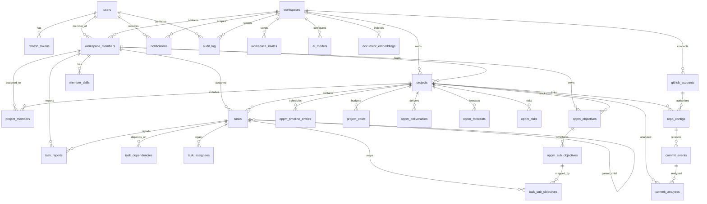

# Clean ER Diagram — Miro Ready

Last updated: 2026-05-01

## Purpose

This is a **simplified, visual-first ER diagram** designed for importing into Miro (or similar whiteboarding tools).

- Each box = one PostgreSQL table
- Each line = a foreign-key relationship
- Colors group tables by **owning service / domain**
- No implementation noise — just entities and cardinalities

---

## Color Legend (for Miro)

| Color | Domain / Service | Tables |
|---|---|---|
| 🟦 Blue | Auth & Identity | `users`, `refresh_tokens` |
| 🟩 Green | Workspace & Team | `workspaces`, `workspace_members`, `workspace_invites`, `member_skills` |
| 🟨 Yellow | Project & Task | `projects`, `project_members`, `tasks`, `task_reports`, `task_dependencies`, `task_assignees` |
| 🟪 Purple | OPPM Planning | `oppm_objectives`, `oppm_sub_objectives`, `task_sub_objectives`, `oppm_timeline_entries`, `project_costs`, `oppm_deliverables`, `oppm_forecasts`, `oppm_risks` |
| 🟥 Red | GitHub Integration | `github_accounts`, `repo_configs`, `commit_events`, `commit_analyses` |
| 🟫 Brown | AI & Retrieval | `ai_models`, `document_embeddings` |
| ⬜ Gray | Cross-Cutting | `notifications`, `audit_log` |

---

## Entity Boxes (copy-paste into Miro)

### 🔷 users
- `id` PK UUID
- `email` VARCHAR
- `full_name` VARCHAR
- `password_hash` VARCHAR
- `created_at` TIMESTAMPTZ

### 🔷 refresh_tokens
- `id` PK UUID
- `user_id` FK → users
- `token_hash` VARCHAR
- `expires_at` TIMESTAMPTZ

---

### 🟩 workspaces
- `id` PK UUID
- `name` VARCHAR
- `slug` VARCHAR
- `owner_id` FK → users
- `created_at` TIMESTAMPTZ

### 🟩 workspace_members
- `id` PK UUID
- `workspace_id` FK → workspaces
- `user_id` FK → users
- `role` VARCHAR (owner/admin/member/viewer)
- `display_name` VARCHAR

### 🟩 workspace_invites
- `id` PK UUID
- `workspace_id` FK → workspaces
- `email` VARCHAR
- `role` VARCHAR
- `token` VARCHAR
- `expires_at` TIMESTAMPTZ

### 🟩 member_skills
- `id` PK UUID
- `workspace_member_id` FK → workspace_members
- `skill_name` VARCHAR
- `proficiency` VARCHAR

---

### 🟨 projects
- `id` PK UUID
- `workspace_id` FK → workspaces
- `lead_id` FK → workspace_members
- `title` VARCHAR
- `project_code` VARCHAR
- `objective_summary` TEXT
- `budget` NUMERIC
- `planning_hours` INTEGER
- `priority` VARCHAR
- `status` VARCHAR
- `start_date` DATE
- `deadline` DATE
- `end_date` DATE

### 🟨 project_members
- `id` PK UUID
- `project_id` FK → projects
- `member_id` FK → workspace_members
- `role` VARCHAR

### 🟨 tasks
- `id` PK UUID
- `project_id` FK → projects
- `workspace_id` FK → workspaces
- `title` VARCHAR
- `description` TEXT
- `priority` VARCHAR
- `status` VARCHAR
- `assignee_id` FK → workspace_members
- `parent_task_id` FK → tasks (self)
- `oppm_objective_id` FK → oppm_objectives
- `start_date` DATE
- `due_date` DATE

### 🟨 task_reports
- `id` PK UUID
- `task_id` FK → tasks
- `reported_by` FK → workspace_members
- `content` TEXT
- `is_approved` BOOLEAN
- `approved_by` FK → workspace_members

### 🟨 task_dependencies
- `id` PK UUID
- `task_id` FK → tasks
- `depends_on_task_id` FK → tasks

### 🟨 task_assignees (legacy)
- `id` PK UUID
- `task_id` FK → tasks
- `workspace_member_id` FK → workspace_members

---

### 🟪 oppm_objectives
- `id` PK UUID
- `project_id` FK → projects
- `title` VARCHAR
- `priority` VARCHAR (A/B/C)
- `owner_id` FK → workspace_members
- `status` VARCHAR

### 🟪 oppm_sub_objectives
- `id` PK UUID
- `objective_id` FK → oppm_objectives
- `title` VARCHAR
- `position` INTEGER

### 🟪 task_sub_objectives
- `id` PK UUID
- `task_id` FK → tasks
- `sub_objective_id` FK → oppm_sub_objectives

### 🟪 oppm_timeline_entries
- `id` PK UUID
- `project_id` FK → projects
- `week_start` DATE
- `status` VARCHAR
- `quality` VARCHAR

### 🟪 project_costs
- `id` PK UUID
- `project_id` FK → projects
- `category` VARCHAR
- `planned` NUMERIC
- `actual` NUMERIC

### 🟪 oppm_deliverables
- `id` PK UUID
- `project_id` FK → projects
- `name` VARCHAR
- `due_date` DATE
- `status` VARCHAR

### 🟪 oppm_forecasts
- `id` PK UUID
- `project_id` FK → projects
- `forecast_date` DATE
- `confidence` VARCHAR
- `note` TEXT

### 🟪 oppm_risks
- `id` PK UUID
- `project_id` FK → projects
- `description` TEXT
- `impact` VARCHAR
- `mitigation` TEXT
- `status` VARCHAR

---

### 🔴 github_accounts
- `id` PK UUID
- `workspace_id` FK → workspaces
- `github_user_id` VARCHAR
- `username` VARCHAR
- `encrypted_token` VARCHAR

### 🔴 repo_configs
- `id` PK UUID
- `github_account_id` FK → github_accounts
- `project_id` FK → projects
- `repository_full_name` VARCHAR
- `webhook_secret` VARCHAR

### 🔴 commit_events
- `id` PK UUID
- `repo_config_id` FK → repo_configs
- `sha` VARCHAR
- `message` TEXT
- `author_name` VARCHAR
- `committed_at` TIMESTAMPTZ

### 🔴 commit_analyses
- `id` PK UUID
- `commit_event_id` FK → commit_events
- `project_id` FK → projects
- `analysis` TEXT
- `created_at` TIMESTAMPTZ

---

### 🟫 ai_models
- `id` PK UUID
- `workspace_id` FK → workspaces
- `provider` VARCHAR
- `model_name` VARCHAR
- `api_key_encrypted` VARCHAR
- `is_default` BOOLEAN

### 🟫 document_embeddings
- `id` PK UUID
- `workspace_id` FK → workspaces
- `content` TEXT
- `embedding` VECTOR
- `source_type` VARCHAR
- `source_id` UUID

---

### ⬜ notifications
- `id` PK UUID
- `workspace_id` FK → workspaces
- `user_id` FK → users
- `type` VARCHAR
- `title` VARCHAR
- `message` TEXT
- `is_read` BOOLEAN
- `created_at` TIMESTAMPTZ

### ⬜ audit_log
- `id` PK UUID
- `workspace_id` FK → workspaces
- `user_id` FK → users
- `action` VARCHAR
- `entity_type` VARCHAR
- `entity_id` UUID
- `metadata` JSONB
- `created_at` TIMESTAMPTZ

---

## Relationship Map (for Miro connectors)

```text
users ||--o{ refresh_tokens
users ||--o{ workspace_members
users ||--o{ notifications
users ||--o{ audit_log

workspaces ||--o{ workspace_members
workspaces ||--o{ workspace_invites
workspaces ||--o{ projects
workspaces ||--o{ github_accounts
workspaces ||--o{ ai_models
workspaces ||--o{ document_embeddings
workspaces ||--o{ notifications
workspaces ||--o{ audit_log

workspace_members ||--o{ member_skills
workspace_members ||--o{ projects (as lead)
workspace_members ||--o{ project_members
workspace_members ||--o{ tasks (as assignee)
workspace_members ||--o{ task_reports (as reporter / approver)
workspace_members ||--o{ task_assignees
workspace_members ||--o{ oppm_objectives (as owner)

projects ||--o{ project_members
projects ||--o{ tasks
projects ||--o{ oppm_objectives
projects ||--o{ oppm_timeline_entries
projects ||--o{ project_costs
projects ||--o{ oppm_deliverables
projects ||--o{ oppm_forecasts
projects ||--o{ oppm_risks
projects ||--o{ repo_configs
projects ||--o{ commit_analyses

tasks ||--o{ task_reports
tasks ||--o{ task_dependencies
tasks ||--o{ task_assignees (legacy)
tasks ||--o{ task_sub_objectives
tasks }o--o{ tasks (parent/child via parent_task_id)

oppm_objectives ||--o{ oppm_sub_objectives
oppm_sub_objectives ||--o{ task_sub_objectives

github_accounts ||--o{ repo_configs
repo_configs ||--o{ commit_events
commit_events ||--o{ commit_analyses
```

---

## Miro Import Tips

1. **Create sticky notes** for each table using the color legend above
2. **Draw connectors** using the relationship map — use solid lines for FKs, dashed for logical relationships
3. **Group by service** — draw boundary boxes around each color group and label:
   - 🔵 Auth (workspace service)
   - 🟢 Workspace (workspace service)
   - 🟨 Project & Task (workspace service)
   - 🟪 OPPM (workspace service)
   - 🔴 GitHub (integrations service)
   - 🟫 AI (intelligence service)
   - ⬜ Shared (all services)
4. **Add cardinality labels** on connectors: `1`, `1..*`, `0..*`
5. **Export as PNG** from Miro for documentation

---

## Mermaid Source (optional — for markdown viewers)


