# Clean Flowcharts — Miro Ready

Last updated: 2026-05-01

## Purpose

This document extracts the **most important runtime flowcharts** from the system and presents them in a clean, visual format optimized for Miro whiteboarding.

Each flowchart is:
- **Self-contained** — no need to read other docs
- **Color-coded by service** — 🟦 Workspace, 🟩 Intelligence, 🟥 Integrations, 🟨 Automation
- **Mermaid-ready** — copy-paste into Miro's Mermaid import or draw manually

---

## Table of Contents

1. [End-to-End Service Collaboration](#1-end-to-end-service-collaboration)
2. [Request Lifecycle](#2-request-lifecycle)
3. [Cross-Service Calls](#3-cross-service-calls)
4. [App Bootstrap & Auth Refresh](#4-app-bootstrap--auth-refresh)
5. [Workspace Invite Acceptance](#5-workspace-invite-acceptance)
6. [Project Creation Wizard](#6-project-creation-wizard)
7. [Task Report Approval](#7-task-report-approval)
8. [GitHub Webhook to Commit Analysis](#8-github-webhook-to-commit-analysis)
9. [AI Chat & RAG Pipeline](#9-ai-chat--rag-pipeline)
10. [Agentic Tool Loop](#10-agentic-tool-loop)
11. [Gateway Routing Decision](#11-gateway-routing-decision)
12. [RAG Pipeline Step-by-Step](#12-rag-pipeline-step-by-step)

---

## 1. End-to-End Service Collaboration

**Purpose:** Shows how the browser request flows through all services.

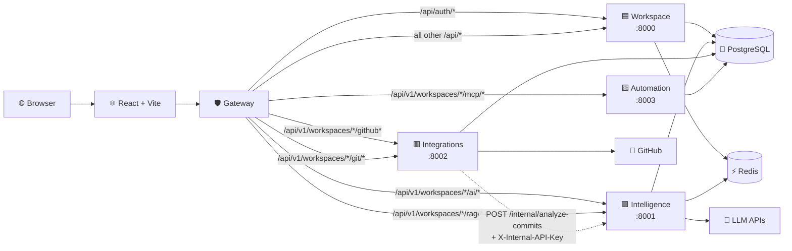

### Miro Tips
- Use **4 colored boxes** for services (🟦🟩🟥🟨)
- Use **1 box** for Gateway
- Use **1 box** for Browser/Frontend
- Draw arrows with **path labels**
- Add **PostgreSQL, Redis, LLM, GitHub** as external boxes

---

## 2. Request Lifecycle

**Purpose:** Shows what happens inside a single API request.

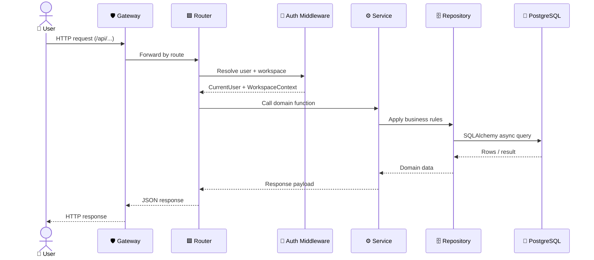

### Miro Tips
- Draw **6 vertical swimlanes**
- Use **arrows** for calls, **dashed arrows** for returns
- Label each step clearly

---

## 3. Cross-Service Calls

**Purpose:** Shows the two main cross-service call chains.

```mermaid
flowchart TD
    subgraph "Chain A: GitHub Push → Analysis"
        A1["🐙 GitHub push"] --> A2["🟥 Webhook route"]
        A2 --> A3["🟥 Store commits"]
        A3 --> A4["🟥 Call AI internal endpoint"]
        A4 --> A5["🟩 Analyze commits"]
        A5 --> A6["💾 commit_analyses stored"]
    end

    subgraph "Chain B: Admin Reindex"
        B1["👤 Admin triggers reindex"] --> B2["🟩 Reindex route"]
        B2 --> B3["🟩 Read workspace data"]
        B3 --> B4["🟩 Generate embeddings"]
        B4 --> B5["💾 document_embeddings upserted"]
    end
```

### Miro Tips
- Draw **2 separate chains** vertically
- Use **color coding** for services
- Add **PostgreSQL** at the end of each chain

---

## 4. App Bootstrap & Auth Refresh

**Purpose:** Shows frontend initialization and token refresh.

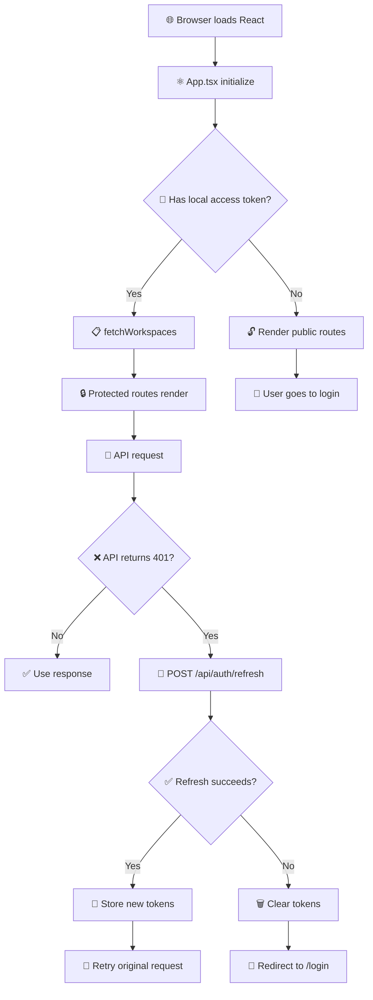

### Miro Tips
- Use **diamond shapes** for decisions
- Use **emoji icons** for visual clarity
- Draw **2 paths** (with/without token)

---

## 5. Workspace Invite Acceptance

**Purpose:** Shows the invite flow from link click to membership.

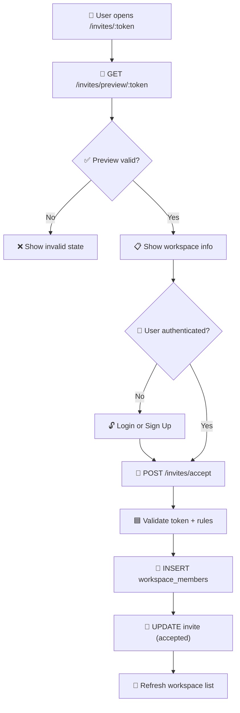

### Miro Tips
- Use **decision diamonds** for validation checks
- Show **both auth paths** converging
- End with **success state**

---

## 6. Project Creation Wizard

**Purpose:** Shows the 2-step project creation flow.

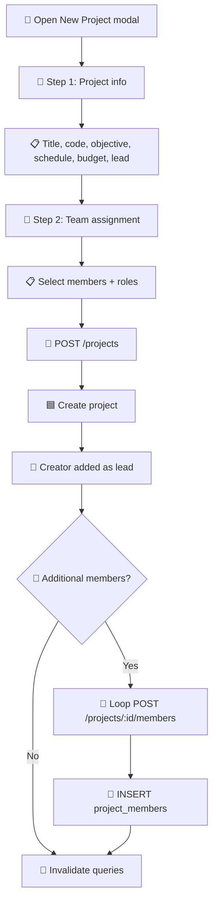

### Miro Tips
- Show **2 wizard steps** as sequential boxes
- Use **decision** for optional team members
- Show **loop** for multiple member additions

---

## 7. Task Report Approval

**Purpose:** Shows the task report submission and approval flow.

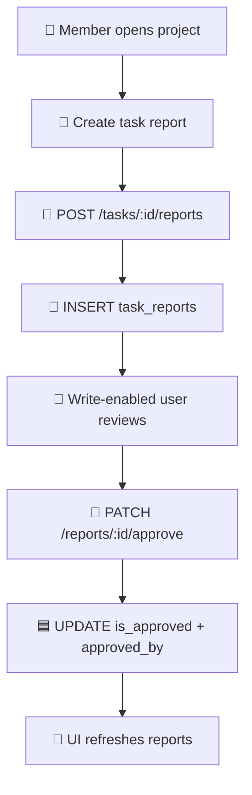

### Miro Tips
- Simple **linear flow**
- Show **2 actors** (member + approver)
- Highlight **state change**

---

## 8. GitHub Webhook to Commit Analysis

**Purpose:** Shows the full webhook → analysis pipeline.

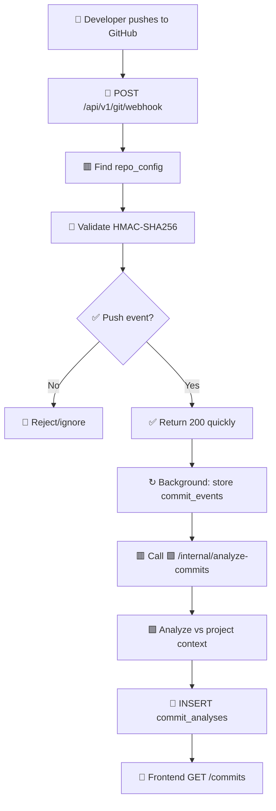

### Miro Tips
- Show **async step** with ↻ symbol
- Highlight **quick response** vs **background processing**
- Show **cross-service call** (🟥 → 🟩)

---

## 9. AI Chat & RAG Pipeline

**Purpose:** Shows the full AI chat flow with RAG and tools.

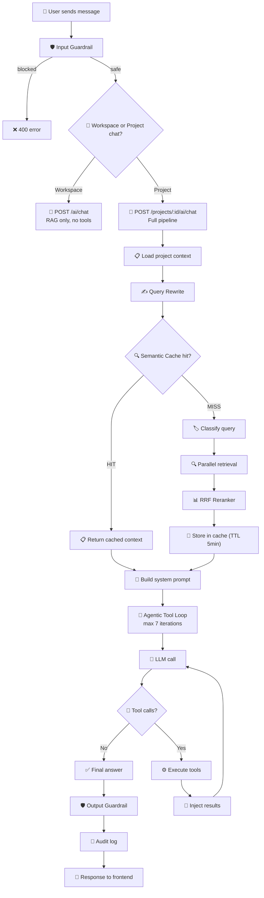

### Miro Tips
- This is a **large flowchart** — consider splitting into 2 boards:
  1. **RAG Pipeline** (steps A → N)
  2. **Tool Loop** (steps O → W)
- Use **decision diamonds** for cache hit and tool calls
- Show **loop arrow** for tool iteration

---

## 10. Agentic Tool Loop

**Purpose:** Zooms into the tool execution loop.

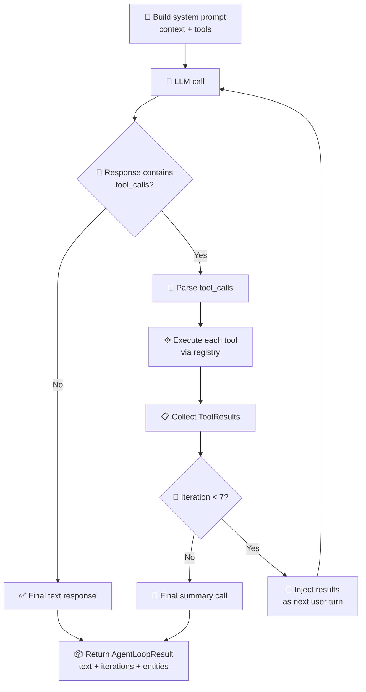

### Miro Tips
- Show **clear loop** with iteration limit
- Use **decision diamond** for tool_calls check
- Show **exit paths** (no tools vs max iterations)

---

## 11. Gateway Routing Decision

**Purpose:** Shows how the gateway decides which service gets the request.

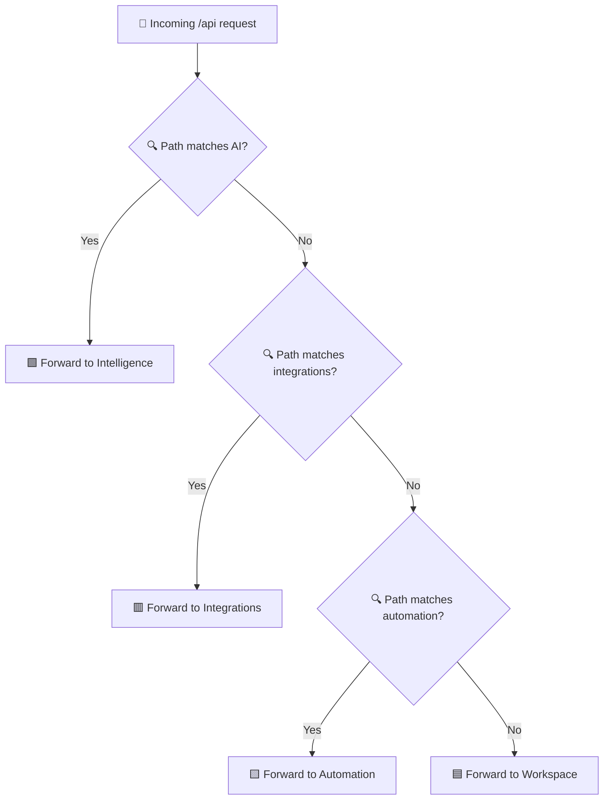

### Miro Tips
- Simple **decision tree**
- Show **4 exit points** (one per service)
- Add **path examples** on each arrow

---

## 12. RAG Pipeline Step-by-Step

**Purpose:** Detailed breakdown of the RAG retrieval pipeline.

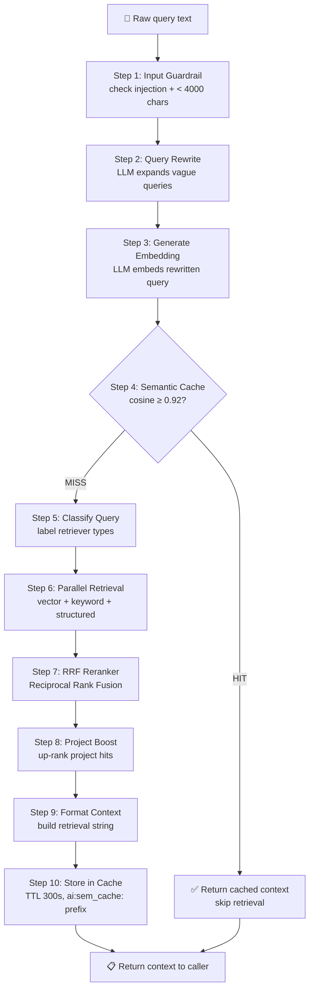

### Miro Tips
- Show **10 numbered steps**
- Use **decision diamond** for cache hit
- Show **shortcut path** (cache hit skips steps 5-10)

---

## Miro Import Guide

### Option 1: Mermaid Import (Fastest)

1. Open Miro
2. Add **Mermaid chart** widget
3. Copy-paste any Mermaid block above
4. Miro auto-generates the diagram

### Option 2: Manual Drawing (Most Control)

1. Create **sticky notes** for each step
2. Use **color coding**:
   - 🟦 Blue = Workspace Service
   - 🟩 Green = Intelligence Service
   - 🟥 Red = Integrations Service
   - 🟨 Yellow = Automation Service
   - ⬜ Gray = External (Browser, DB, Redis, LLM, GitHub)
3. Draw **arrows** between steps
4. Add **decision diamonds** for yes/no branches
5. Group related flows with **frames**

### Recommended Board Layout

```
┌─────────────────────────────────────────┐
│  Board 1: Service Collaboration         │
│  - Flowchart #1 (End-to-End)            │
│  - Flowchart #2 (Request Lifecycle)     │
│  - Flowchart #3 (Cross-Service Calls)   │
└─────────────────────────────────────────┘

┌─────────────────────────────────────────┐
│  Board 2: User Flows                    │
│  - Flowchart #4 (App Bootstrap)         │
│  - Flowchart #5 (Invite Acceptance)   │
│  - Flowchart #6 (Project Creation)    │
│  - Flowchart #7 (Task Report)         │
└─────────────────────────────────────────┘

┌─────────────────────────────────────────┐
│  Board 3: AI & Integration Flows        │
│  - Flowchart #8 (GitHub Webhook)        │
│  - Flowchart #9 (AI Chat Pipeline)    │
│  - Flowchart #10 (Tool Loop)            │
│  - Flowchart #12 (RAG Pipeline)         │
└─────────────────────────────────────────┘

┌─────────────────────────────────────────┐
│  Board 4: Gateway & Routing             │
│  - Flowchart #11 (Gateway Routing)      │
│  - API endpoint cards                   │
│  - Service boundary boxes               │
└─────────────────────────────────────────┘
```

---

## Quick Reference: Flowchart Index

| # | Flowchart | Complexity | Best For |
|---|---|---|---|
| 1 | End-to-End Service Collaboration | Medium | Architecture overview |
| 2 | Request Lifecycle | Low | Onboarding new devs |
| 3 | Cross-Service Calls | Medium | Understanding integrations |
| 4 | App Bootstrap & Auth Refresh | Low | Frontend auth flow |
| 5 | Workspace Invite Acceptance | Low | Team onboarding flow |
| 6 | Project Creation Wizard | Medium | Project management UX |
| 7 | Task Report Approval | Low | Task workflow |
| 8 | GitHub Webhook to Analysis | High | Integration architecture |
| 9 | AI Chat & RAG Pipeline | High | AI feature deep-dive |
| 10 | Agentic Tool Loop | Medium | AI tool execution |
| 11 | Gateway Routing Decision | Low | API routing |
| 12 | RAG Pipeline Step-by-Step | High | RAG implementation |
