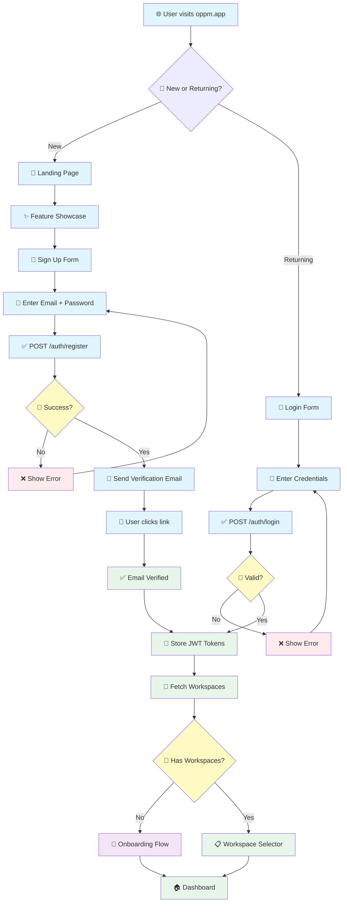
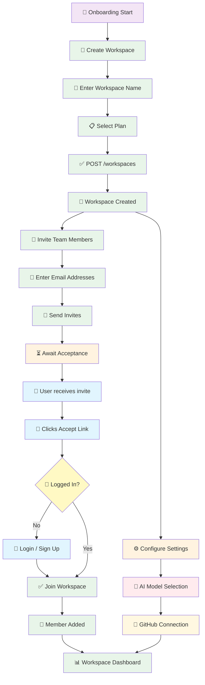
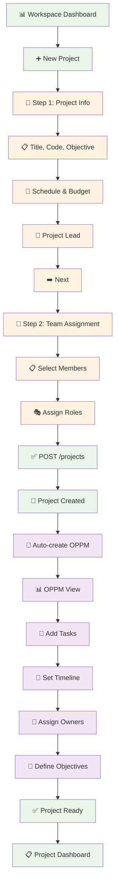
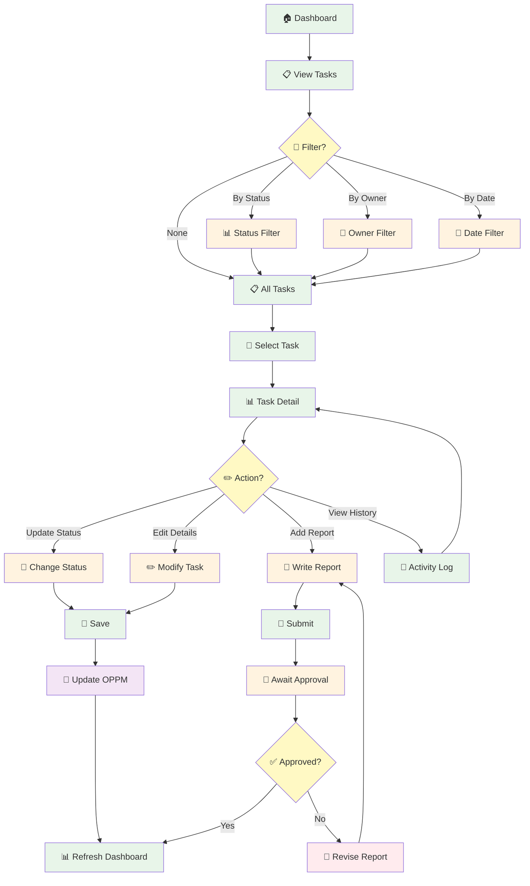
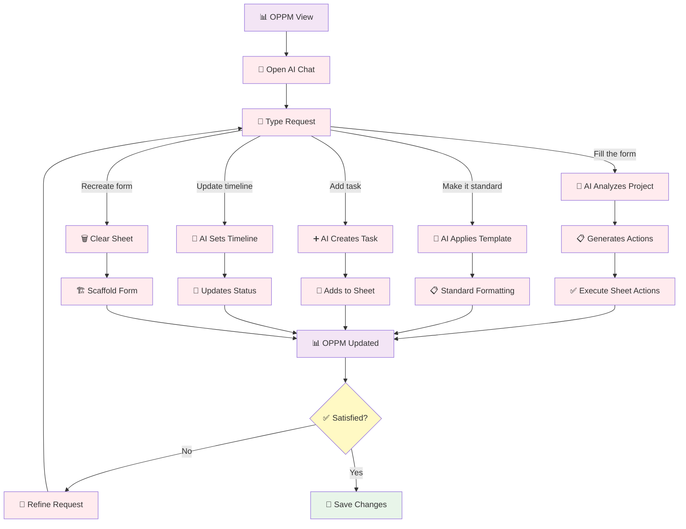
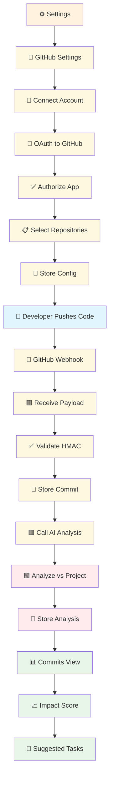
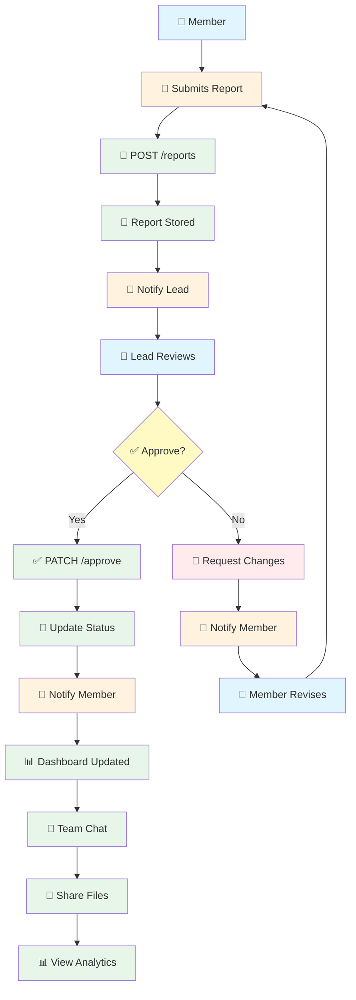
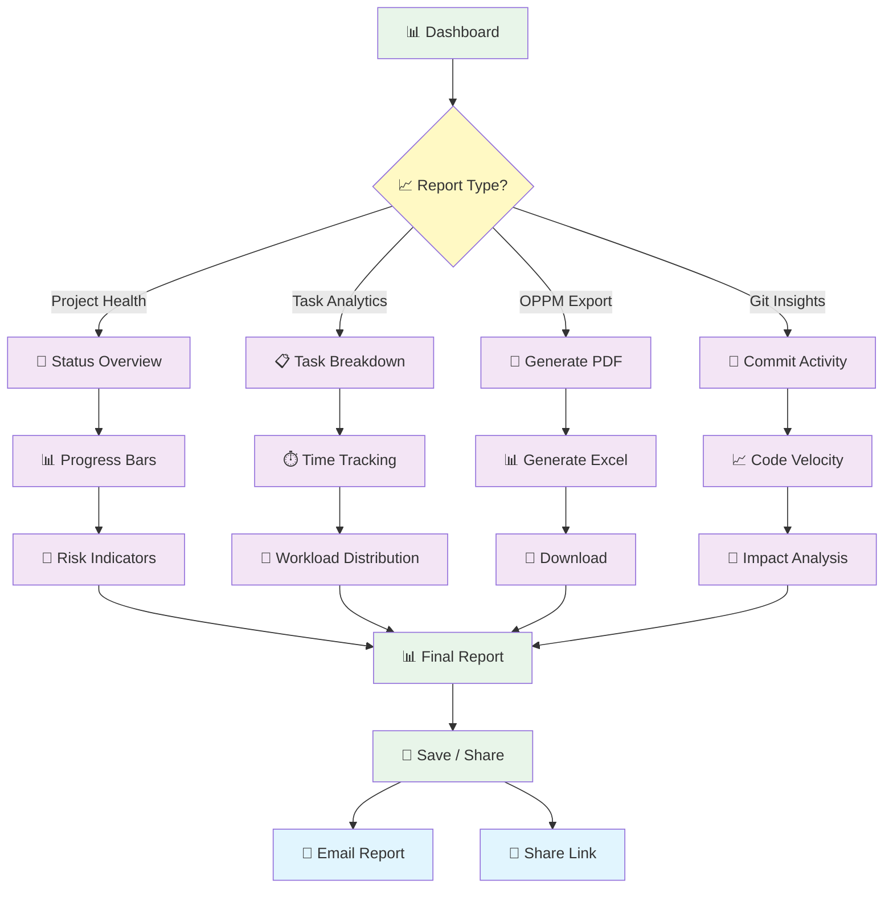

# System — Full User Journey & Feature Flow

> **For:** Miro whiteboard presentation
> **Purpose:** Complete user journey from first landing to daily operations
> **Last updated:** 2026-05-07
> **Color coding:**
> - 🟦 Blue = Auth & Onboarding
> - 🟩 Green = Workspace & Project Management
> - 🟥 Red = AI & Intelligence
> - 🟨 Yellow = Integrations & GitHub
> - 🟪 Purple = OPPM & Reporting
> - ⬜ Gray = External systems

---

## Table of Contents

1. [Master User Journey Map](#1-master-user-journey-map)
2. [Phase 1: Landing & Authentication](#2-phase-1--landing--authentication)
3. [Phase 2: Workspace Onboarding](#3-phase-2--workspace-onboarding)
4. [Phase 3: Project Creation](#4-phase-3--project-creation)
5. [Phase 4: Daily Task Management](#5-phase-4--daily-task-management)
6. [Phase 5: AI-Powered OPPM](#6-phase-5--ai-powered-oppm)
7. [Phase 6: GitHub Integration](#7-phase-6--github-integration)
8. [Phase 7: Team Collaboration](#7-phase-7--team-collaboration)
9. [Phase 8: Reporting & Analytics](#8-phase-8--reporting--analytics)
10. [Feature Flow Matrix](#10-feature-flow-matrix)

---

## 1. Master User Journey Map

**Purpose:** High-level overview of the entire user journey from landing to power user.

```mermaid
flowchart LR
    subgraph "Phase 1: Discovery"
        A1["🌐 Landing Page"] --> A2["🔐 Sign Up / Login"]
        A2 --> A3["📧 Email Verification"]
    end

    subgraph "Phase 2: Onboarding"
        B1["🏢 Create Workspace"] --> B2["👥 Invite Team"]
        B2 --> B3["⚙️ Configure Settings"]
    end

    subgraph "Phase 3: Setup"
        C1["📁 Create Project"] --> C2["📝 Define Tasks"]
        C2 --> C3["📅 Set Timeline"]
        C3 --> C4["👤 Assign Owners"]
    end

    subgraph "Phase 4: Daily Work"
        D1["📋 View Dashboard"] --> D2["✅ Update Tasks"]
        D2 --> D3["🤖 Ask AI Assistant"]
        D3 --> D4["📊 Review OPPM"]
    end

    subgraph "Phase 5: Integration"
        E1["🔗 Connect GitHub"] --> E2["📡 Auto-sync Commits"]
        E2 --> E3["📈 Track Progress"]
    end

    subgraph "Phase 6: Collaboration"
        F1["💬 Team Chat"] --> F2["📎 Share Reports"]
        F2 --> F3["✅ Approve Work"]
    end

    subgraph "Phase 7: Growth"
        G1["📊 Analytics"] --> G2["🎯 Optimize Workflow"]
        G2 --> G3["🏆 Scale Team"]
    end

    A3 --> B1
    B3 --> C1
    C4 --> D1
    D4 --> E1
    E3 --> F1
    F3 --> G1

    style A1 fill:#e1f5fe
    style A2 fill:#e1f5fe
    style A3 fill:#e1f5fe
    style B1 fill:#e8f5e9
    style B2 fill:#e8f5e9
    style B3 fill:#e8f5e9
    style C1 fill:#e8f5e9
    style C2 fill:#e8f5e9
    style C3 fill:#e8f5e9
    style C4 fill:#e8f5e9
    style D1 fill:#fff3e0
    style D2 fill:#fff3e0
    style D3 fill:#ffebee
    style D4 fill:#f3e5f5
    style E1 fill:#fff8e1
    style E2 fill:#fff8e1
    style E3 fill:#fff8e1
    style F1 fill:#e8f5e9
    style F2 fill:#e8f5e9
    style F3 fill:#e8f5e9
    style G1 fill:#f3e5f5
    style G2 fill:#f3e5f5
    style G3 fill:#f3e5f5
```



### Miro Layout Tips
- **Horizontal swimlanes** for each phase
- **Color-coded phases** (see legend above)
- **Arrow thickness** indicates frequency (thick = daily, thin = one-time)
- Add **time estimates** under each phase (e.g., "Phase 1: 2 minutes")

---

## 2. Phase 1: Landing & Authentication

**Purpose:** First-time user experience from landing to authenticated.



### Key Decision Points
| # | Decision | Outcome |
|---|----------|---------|
| 1 | New or Returning? | Different flows for registration vs login |
| 2 | Registration success? | Retry on error |
| 3 | Has workspaces? | Skip onboarding if returning user |

### Miro Tips
- Use **2 colors**: Blue for auth steps, Green for success
- Show **loop backs** for error retry
- Add **time estimate**: "Phase 1: 2-5 minutes"

---

## 3. Phase 2: Workspace Onboarding

**Purpose:** First-time workspace setup and team invitation.



### Key Decision Points
| # | Decision | Outcome |
|---|----------|---------|
| 1 | Invitee logged in? | Redirect to login if needed |
| 2 | Plan selection | Free / Pro / Enterprise |

### Miro Tips
- Show **parallel paths**: Invite team + Configure settings happen simultaneously
- Use **dashed arrows** for async steps (email sending)
- Add **role icons**: Admin (👑), Member (👤), Viewer (👁️)

---

## 4. Phase 3: Project Creation

**Purpose:** Creating a new project with full OPPM setup.



### Key Decision Points
| # | Decision | Outcome |
|---|----------|---------|
| 1 | Project methodology | Traditional OPPM / Agile / Waterfall |
| 2 | Team roles | Lead, Member, Viewer |

### Miro Tips
- Show **2-step wizard** clearly
- Use **purple** for OPPM-specific steps
- Add **progress bar** visualization

---

## 5. Phase 4: Daily Task Management

**Purpose:** Day-to-day task updates and tracking.



### Key Decision Points
| # | Decision | Outcome |
|---|----------|---------|
| 1 | Filter type? | Status / Owner / Date / None |
| 2 | Action on task? | Update / Report / Edit / History |
| 3 | Report approved? | Revise if rejected |

### Miro Tips
- Show **4 filter options** as branches
- Use **diamond** for action selection
- Show **approval loop** clearly

---

## 6. Phase 5: AI-Powered OPPM

**Purpose:** Using AI to create, fill, and manage OPPM sheets.



### AI Request Types
| Request | AI Action | Result |
|---------|-----------|--------|
| "Fill the form" | Analyzes project data → generates actions | Complete OPPM |
| "Make it standard" | Applies template rules | Standardized formatting |
| "Add task X" | Creates task row | New task added |
| "Update timeline" | Sets status dots | Timeline updated |
| "Recreate form" | Clears + scaffolds | Fresh form |

### Miro Tips
- Use **red** for AI steps
- Show **5 request types** as branches
- Add **feedback loop** for refinement

---

## 7. Phase 6: GitHub Integration

**Purpose:** Connecting GitHub for automatic commit tracking.



### Key Decision Points
| # | Decision | Outcome |
|---|----------|---------|
| 1 | Repository selection | Which repos to track |
| 2 | Webhook validation | HMAC-SHA256 check |

### Miro Tips
- Show **2 phases**: Setup (yellow) + Runtime (green)
- Use **dashed arrows** for webhook flow
- Add **GitHub icon** 🐙

---

## 8. Phase 7: Team Collaboration

**Purpose:** Team communication and approval workflows.



### Key Decision Points
| # | Decision | Outcome |
|---|----------|---------|
| 1 | Approve report? | Yes → notify + update / No → request changes |

### Miro Tips
- Show **2 actors** (Member + Lead)
- Use **loop back** for revision cycle
- Add **notification icons** 🔔

---

## 9. Phase 8: Reporting & Analytics

**Purpose:** Viewing project health and generating reports.



### Report Types
| Type | Data | Format |
|------|------|--------|
| Project Health | Status, progress, risks | Dashboard |
| Task Analytics | Breakdown, time, workload | Charts |
| OPPM Export | Full OPPM form | PDF / Excel |
| Git Insights | Commits, velocity, impact | Charts |

### Miro Tips
- Show **4 report branches**
- Use **purple** for analytics
- Add **export icons** 📄 📊

---

## 10. Feature Flow Matrix

**Purpose:** Cross-reference all features with their flows.

| Feature | Phase | Entry Point | Key Flow | Complexity |
|---------|-------|-------------|----------|------------|
| **Sign Up** | 1 | Landing page | Register → Verify → Login | Low |
| **Login** | 1 | Landing page | Credentials → JWT → Dashboard | Low |
| **Create Workspace** | 2 | Onboarding | Name → Plan → Invite | Medium |
| **Invite Members** | 2 | Workspace settings | Email → Link → Accept | Medium |
| **Create Project** | 3 | Dashboard | Wizard → Team → OPPM | Medium |
| **Add Tasks** | 4 | Project view | Form → Save → Update OPPM | Low |
| **Update Status** | 4 | Task detail | Select → Save → Refresh | Low |
| **Submit Report** | 4 | Task detail | Write → Submit → Await approval | Medium |
| **Approve Report** | 7 | Notifications | Review → Approve/Reject → Notify | Medium |
| **AI Fill OPPM** | 5 | AI Chat | Request → Analyze → Execute | High |
| **AI Make Standard** | 5 | AI Chat | Request → Template → Apply | Medium |
| **AI Add Task** | 5 | AI Chat | Request → Generate → Insert | Low |
| **Connect GitHub** | 6 | Settings | OAuth → Select repos → Webhook | Medium |
| **View Commits** | 6 | Commits tab | Push → Analyze → Display | Medium |
| **Export OPPM** | 8 | OPPM view | Generate → Download | Low |
| **View Analytics** | 8 | Dashboard | Select → Filter → Display | Medium |
| **Team Chat** | 7 | Chat panel | Message → Send → Receive | Low |
| **Update Profile** | 2 | Settings | Edit → Save → Confirm | Low |
| **Switch Workspace** | 2 | Header dropdown | Select → Load → Refresh | Low |

### Miro Tips
- Create **table sticky notes** for each row
- Use **color coding** for complexity (Green=Low, Yellow=Medium, Red=High)
- Group by **phase** with frames

---

## Miro Board Layout Recommendation

```
┌─────────────────────────────────────────────────────────────┐
│  BOARD 1: Master Journey (High-Level)                     │
│  - Phase 1-7 horizontal flow                                │
│  - Color-coded swimlanes                                    │
│  - Time estimates per phase                                 │
└─────────────────────────────────────────────────────────────┘

┌─────────────────────────────────────────────────────────────┐
│  BOARD 2: Authentication & Onboarding (Phase 1-2)         │
│  - Landing → Login/Register → Verify → Workspace            │
│  - Invite flow detail                                       │
│  - Decision diamonds for auth states                        │
└─────────────────────────────────────────────────────────────┘

┌─────────────────────────────────────────────────────────────┐
│  BOARD 3: Project Lifecycle (Phase 3-4)                     │
│  - Creation wizard (2 steps)                                │
│  - Task management daily flow                               │
│  - Report submission & approval                             │
└─────────────────────────────────────────────────────────────┘

┌─────────────────────────────────────────────────────────────┐
│  BOARD 4: AI & Integrations (Phase 5-6)                   │
│  - AI chat flow (5 request types)                           │
│  - GitHub connection & webhook                              │
│  - Commit analysis pipeline                                 │
└─────────────────────────────────────────────────────────────┘

┌─────────────────────────────────────────────────────────────┐
│  BOARD 5: Collaboration & Analytics (Phase 7-8)             │
│  - Team collaboration flow                                  │
│  - Reporting & export options                               │
│  - Feature flow matrix table                                │
└─────────────────────────────────────────────────────────────┘
```

---

## How to Import into Miro

### Option 1: Mermaid Import (Recommended)
1. Open Miro board
2. Add **Mermaid Chart** widget
3. Copy-paste any Mermaid block from this document
4. Miro auto-generates the diagram
5. Adjust colors and layout as needed

### Option 2: Manual Drawing
1. Create **frames** for each phase
2. Use **sticky notes** for each step
3. Use **arrows** for connections
4. Add **decision diamonds** for branches
5. Use **color coding** from legend

### Color Palette
| Color | Hex | Use |
|-------|-----|-----|
| Blue | #E1F5FE | Auth & external |
| Green | #E8F5E9 | Workspace & success |
| Yellow | #FFF3E0 | Forms & input |
| Red | #FFEBEE | AI & processing |
| Purple | #F3E5F5 | OPPM & analytics |
| Gray | #F5F5F5 | External systems |

---

*Last updated: 2026-05-07*
*Version: 1.0*
