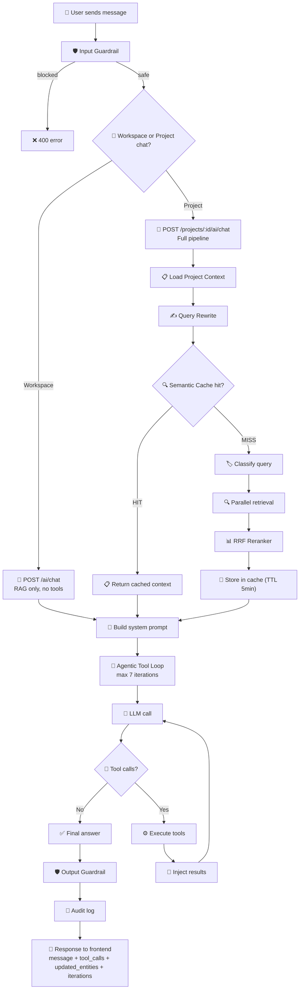
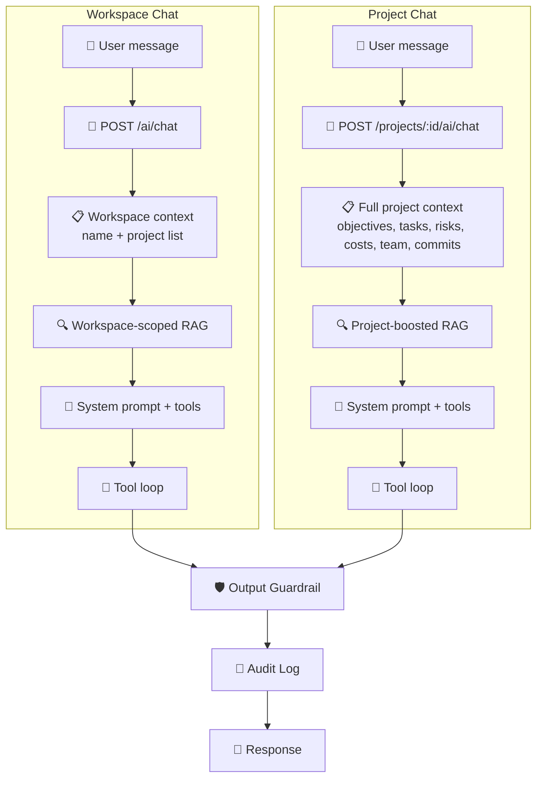
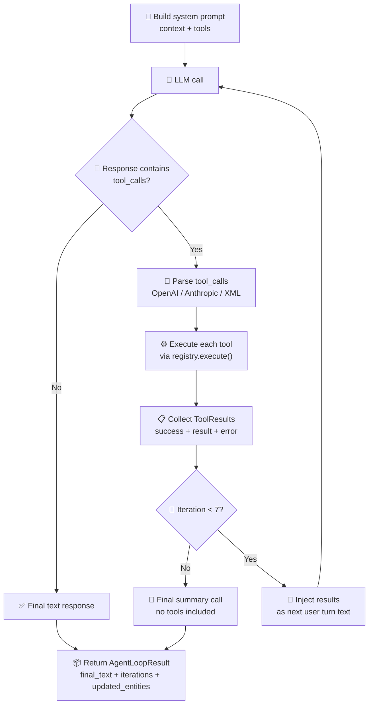
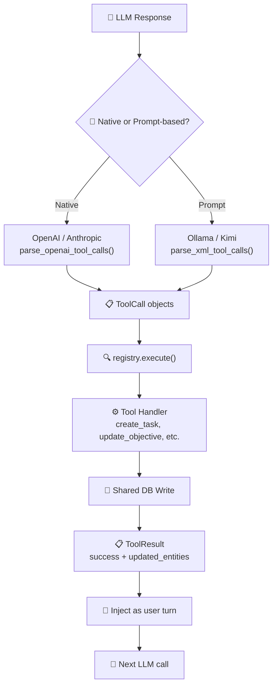
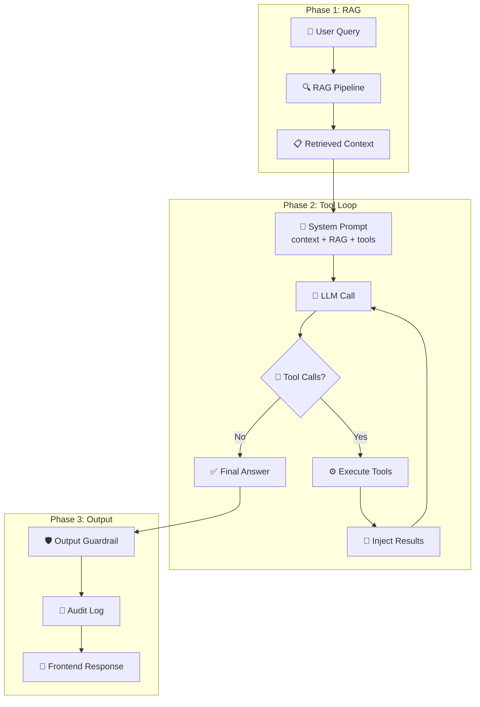

# AI Tool Calling with RAG — Miro Ready

Last updated: 2026-05-01

## Purpose

This document visualizes the **complete AI chat flow** combining RAG retrieval with the agentic tool loop. Use it to understand how the Intelligence Service processes user messages end-to-end.

Each flowchart is:
- **Self-contained** — copy-paste into Miro
- **Color-coded by phase** — 🟦 Input, 🟩 RAG, 🟨 Tool Loop, 🟥 Output
- **Mermaid-ready** — import directly or draw manually

---

## Table of Contents

1. [Full AI Chat Flow](#1-full-ai-chat-flow)
2. [Workspace vs Project Chat](#2-workspace-vs-project-chat)
3. [Agentic Tool Loop Detail](#3-agentic-tool-loop-detail)
4. [Tool Registry Execution](#4-tool-registry-execution)
5. [RAG + Tools Combined](#5-rag--tools-combined)

---

## 1. Full AI Chat Flow

**Purpose:** End-to-end flow from user message to AI response.

### Miro Tips
- This is a **large flowchart** — consider splitting into 2 boards:
  1. **RAG Pipeline** (steps A → N)
  2. **Tool Loop** (steps O → W)
- Use **decision diamonds** for chat type, cache hit, and tool calls
- Show **loop arrow** for tool iteration

---

## 2. Workspace vs Project Chat

**Purpose:** Compares the two chat modes side-by-side.

### Miro Tips
- Draw **2 vertical swimlanes** side-by-side
- Show **same ending** converging
- Highlight **extra context** in project chat

---

## 3. Agentic Tool Loop Detail

**Purpose:** Zooms into the tool execution loop.

### Miro Tips
- Show **clear loop** with iteration limit
- Use **decision diamond** for tool_calls check
- Show **exit paths** (no tools vs max iterations)

---

## 4. Tool Registry Execution

**Purpose:** How tools are discovered, parsed, and executed.

### Miro Tips
- Show **2 parsing paths** converging
- Highlight **registry.execute()** as central hub
- Show **DB write** as real side effect

---

## 5. RAG + Tools Combined

**Purpose:** Shows how RAG context and tool results feed into the same LLM prompt.

### Miro Tips
- Draw **3 horizontal phases**
- Show **RAG output** feeding into tool loop
- Use **different colors** for each phase

---

## Miro Import Guide

### Option 1: Mermaid Import (Fastest)

1. Open Miro
2. Add **Mermaid chart** widget
3. Copy-paste any Mermaid block above
4. Miro auto-generates the diagram

### Option 2: Manual Drawing (Most Control)

1. Use **4 colors** for phases:
   - 🟦 Blue = Input / Guardrails
   - 🟩 Green = RAG / Retrieval
   - 🟨 Yellow = Tool Loop
   - 🟥 Red = Output / Response
2. Add **emoji icons** for visual clarity
3. Use **decision diamonds** for yes/no branches
4. Label **all arrows** with action names
