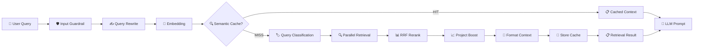
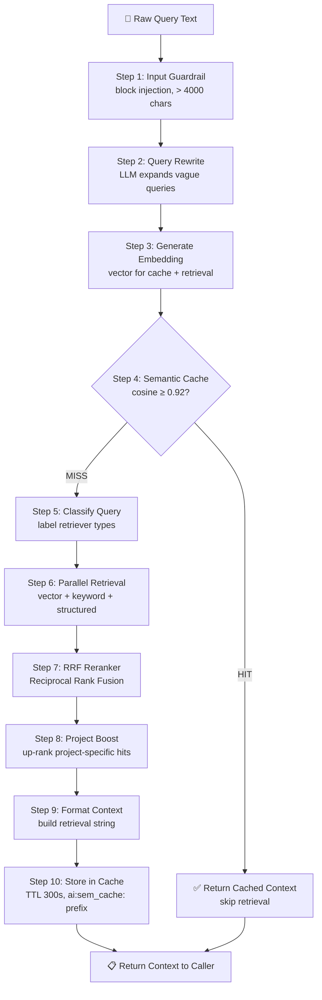
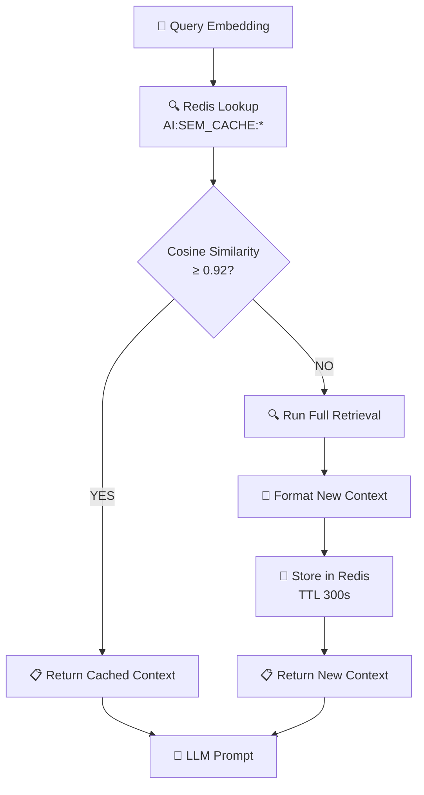
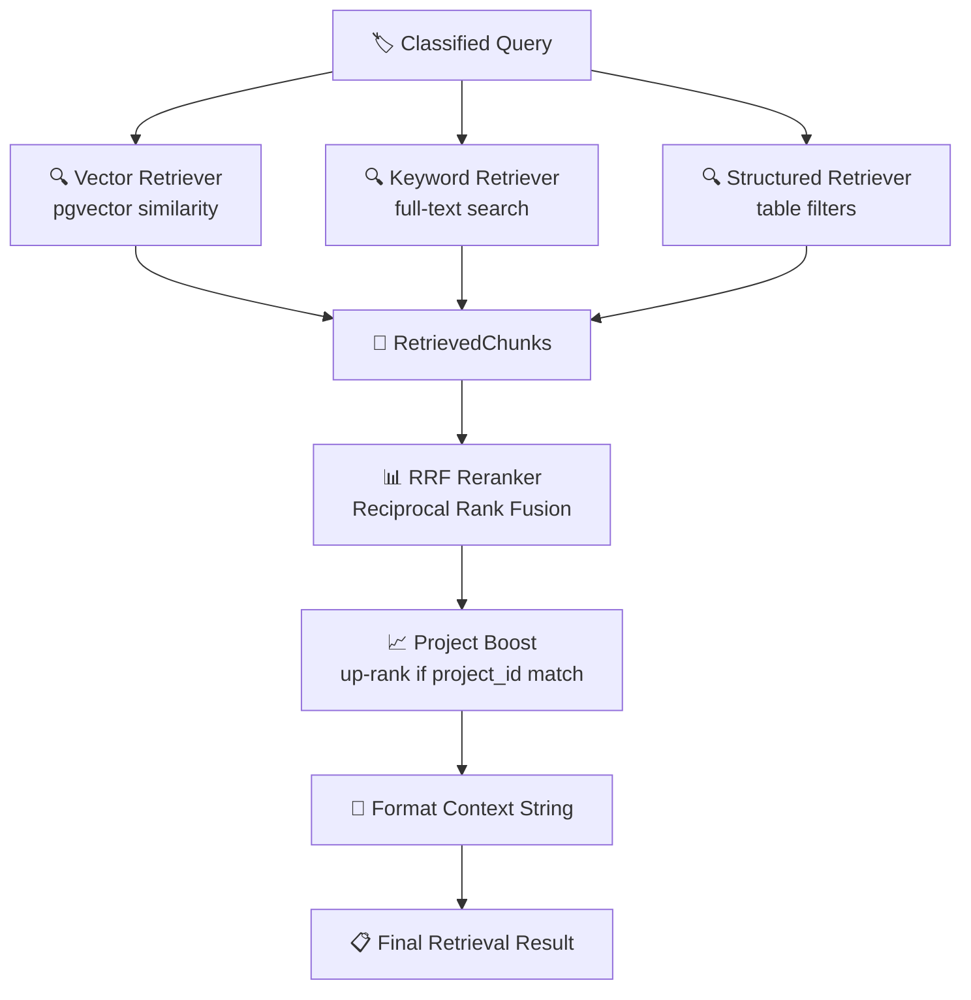
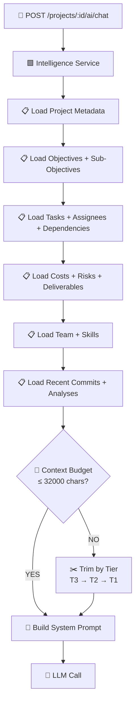

# RAG System Architecture — Miro Ready

Last updated: 2026-05-01

## Purpose

This document visualizes the **Retrieval-Augmented Generation (RAG) pipeline** in the Intelligence Service. Use it to understand how user queries become structured context for the LLM.

Each flowchart is:
- **Self-contained** — copy-paste into Miro
- **Color-coded by stage** — 🟦 Input, 🟩 Processing, 🟨 Retrieval, 🟥 Output
- **Mermaid-ready** — import directly or draw manually

---

## Table of Contents

1. [RAG Pipeline Overview](#1-rag-pipeline-overview)
2. [RAG Step-by-Step](#2-rag-step-by-step)
3. [Semantic Cache Flow](#3-semantic-cache-flow)
4. [Parallel Retrieval & Reranking](#4-parallel-retrieval--reranking)
5. [Project Context Builder](#5-project-context-builder)

---

## 1. RAG Pipeline Overview

**Purpose:** High-level view of how a user query becomes LLM context.

### Miro Tips
- Draw as **horizontal pipeline** (left to right)
- Use **diamond** for cache decision
- Show **shortcut arrow** (cache hit skips retrieval)

---

## 2. RAG Step-by-Step

**Purpose:** Detailed breakdown of each pipeline stage.

### Miro Tips
- Number each step **1-10**
- Use **decision diamond** for cache hit
- Show **shortcut path** (cache hit skips steps 5-10)

---

## 3. Semantic Cache Flow

**Purpose:** How Redis semantic cache avoids redundant retrieval.

### Miro Tips
- Show **Redis** as external database icon
- Highlight **threshold** (0.92) on decision diamond
- Show **TTL 300s** on cache store

---

## 4. Parallel Retrieval & Reranking

**Purpose:** How three retrievers work together and merge results.

### Miro Tips
- Show **3 parallel boxes** for retrievers
- Merge into **single funnel** for RRF
- Show **project boost** as extra step after merge

---

## 5. Project Context Builder

**Purpose:** How project-scoped chat loads structured data into the LLM context window.

### Miro Tips
- Show **6 data sources** as stacked boxes
- Use **decision** for budget check
- Show **trimming** as fallback path

---

## Miro Import Guide

### Option 1: Mermaid Import (Fastest)

1. Open Miro
2. Add **Mermaid chart** widget
3. Copy-paste any Mermaid block above
4. Miro auto-generates the diagram

### Option 2: Manual Drawing (Most Control)

1. Use **4 colors** for stages:
   - 🟦 Blue = Input / Guardrails
   - 🟩 Green = Processing / Transform
   - 🟨 Yellow = Retrieval / Cache
   - 🟥 Red = Output / LLM
2. Add **emoji icons** for visual clarity
3. Use **decision diamonds** for yes/no branches
4. Label **all arrows** with action names
