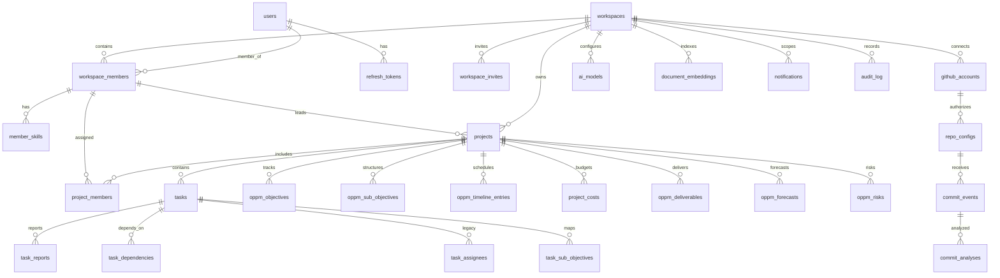

# Service-Oriented ER Diagram

Last updated: 2026-04-20

## Purpose

This ER diagram groups the main relationship chains by service/data domain.

For full canonical schema and all table details, use:

- [../ERD.md](../ERD.md)
- [../DATABASE-SCHEMA.md](../DATABASE-SCHEMA.md)

## ER View

## Service-Domain Notes

- Core service is the main owner for schema evolution and most table writes.
- AI service owns AI-specific tables and can mutate shared business tables via tools.
- Git service owns GitHub ingestion tables and analysis persistence flow.
- MCP and gateway do not own dedicated table domains.

