# Service-Oriented ER Diagram

Last updated: 2026-04-20

## Purpose

This ER diagram groups the main relationship chains by service/data domain.

For full canonical schema and all table details, use:

- [schema.md](schema.md) — Full canonical schema reference (32 tables, all columns, constraints, indexes)
- [../architecture/miro/er-diagram.md](../architecture/miro/er-diagram.md) — Miro-ready visual ER diagram

## ER View

```mermaid
erDiagram
    users ||--o{ workspace_members : member_of
    users ||--o{ refresh_tokens : has
    workspaces ||--o{ workspace_members : contains
    workspaces ||--o{ workspace_invites : invites
    workspace_members ||--o{ member_skills : has

    workspaces ||--o{ projects : owns
    workspace_members ||--o{ projects : leads
    projects ||--o{ project_members : includes
    workspace_members ||--o{ project_members : assigned

    projects ||--o{ tasks : contains
    tasks ||--o{ task_reports : reports
    tasks ||--o{ task_dependencies : depends_on
    tasks ||--o{ task_assignees : legacy

    projects ||--o{ oppm_objectives : tracks
    projects ||--o{ oppm_sub_objectives : structures
    tasks ||--o{ task_sub_objectives : maps
    projects ||--o{ oppm_timeline_entries : schedules
    projects ||--o{ project_costs : budgets
    projects ||--o{ oppm_deliverables : delivers
    projects ||--o{ oppm_forecasts : forecasts
    projects ||--o{ oppm_risks : risks
    projects ||--o{ oppm_templates : templates
    projects ||--o{ oppm_header : header
    projects ||--o{ oppm_task_items : task_items
    oppm_task_items ||--o{ oppm_task_items : parent_child

    projects ||--o{ epics : has
    projects ||--o{ user_stories : has
    projects ||--o{ sprints : has
    projects ||--o{ retrospectives : has
    epics ||--o{ user_stories : contains
    sprints ||--o{ user_stories : contains
    sprints ||--o{ retrospectives : reviews

    projects ||--o{ project_phases : phases
    project_phases ||--o{ phase_documents : documents

    workspaces ||--o{ github_accounts : connects
    github_accounts ||--o{ repo_configs : authorizes
    repo_configs ||--o{ commit_events : receives
    commit_events ||--o{ commit_analyses : analyzed

    workspaces ||--o{ ai_models : configures
    workspaces ||--o{ document_embeddings : indexes

    workspaces ||--o{ notifications : scopes
    workspaces ||--o{ audit_log : records
```

## Service-Domain Notes

- Workspace service is the main owner for schema evolution and most table writes.
- Intelligence service owns AI-specific tables and can mutate shared business tables via tools.
- Integrations service owns GitHub ingestion tables and analysis persistence flow.
- Automation and gateway do not own dedicated table domains.

