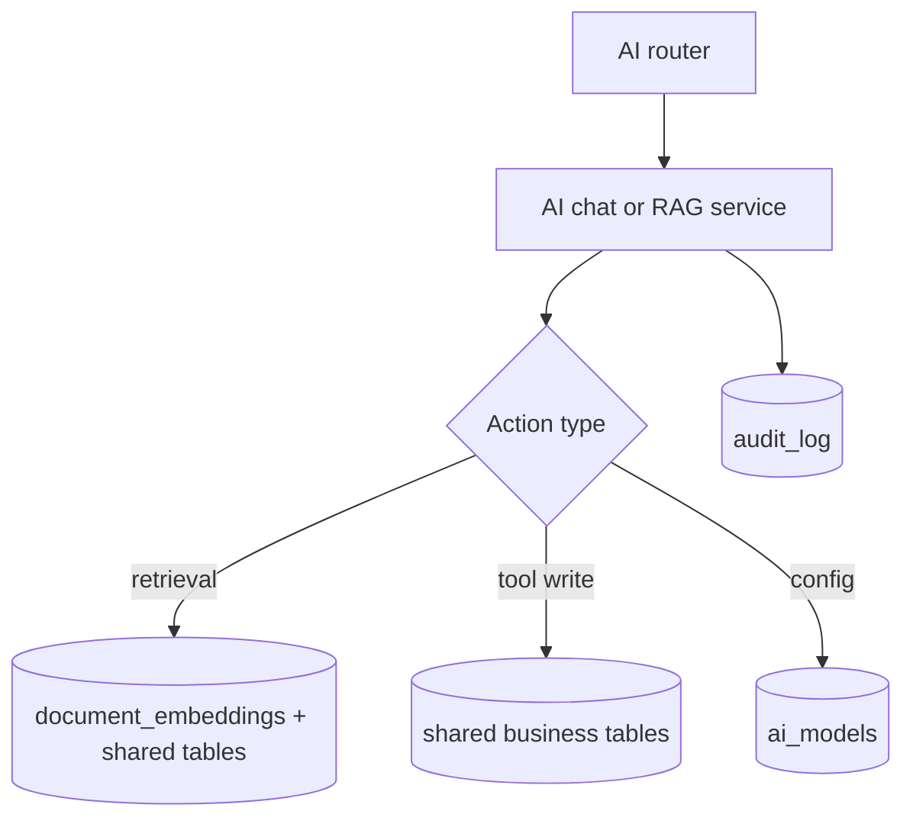

# AI Service Database Map

Last updated: 2026-04-20

## Role

AI service owns AI-specific persistence and can also read/write shared business tables through tool handlers and repositories.

## Primary Tables

- `ai_models`
- `document_embeddings`
- `audit_log` (feedback and traceability events)

## Shared Table Touchpoints

Through AI tools/repositories, AI can touch shared domains such as:

- projects and project metadata
- tasks and task dependencies
- OPPM objectives/timeline/costs/risks/deliverables
- commit analyses context joins

## Data Flow Summary

## Change Impact

- Retrieval/index model changes may alter `document_embeddings` usage and indexing behavior.
- Tool contract changes can affect shared business tables beyond AI-specific tables.
- Keep AI internal analysis contracts aligned with Git service payload and headers.

