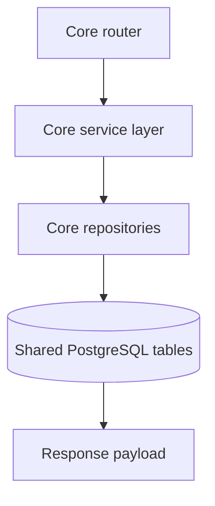

# Core Service Database Map

Last updated: 2026-04-20

## Role

Core is the primary database owner service for business-domain CRUD and migration lifecycle.

Migration ownership:

- Alembic chain in `services/core/alembic/`

## Main Table Coverage

Core reads/writes most application domains:

- Identity/auth: `users`, `refresh_tokens`
- Workspace/team: `workspaces`, `workspace_members`, `workspace_invites`, `member_skills`
- Project/task execution: `projects`, `project_members`, `tasks`, `task_reports`, `task_dependencies`, `task_assignees`, `task_owners`
- OPPM planning: `oppm_objectives`, `oppm_sub_objectives`, `task_sub_objectives`, `oppm_timeline_entries`, `project_costs`, `oppm_deliverables`, `oppm_forecasts`, `oppm_risks`
- Support: `notifications`, `audit_log`

## Data Flow Summary

## Change Impact

- New/changed table contracts almost always require core migration updates.
- Core auth/tenancy constraints must remain aligned with `shared/auth.py`.
- After schema changes, update `../../DATABASE-SCHEMA.md` and `../../ERD.md`.

