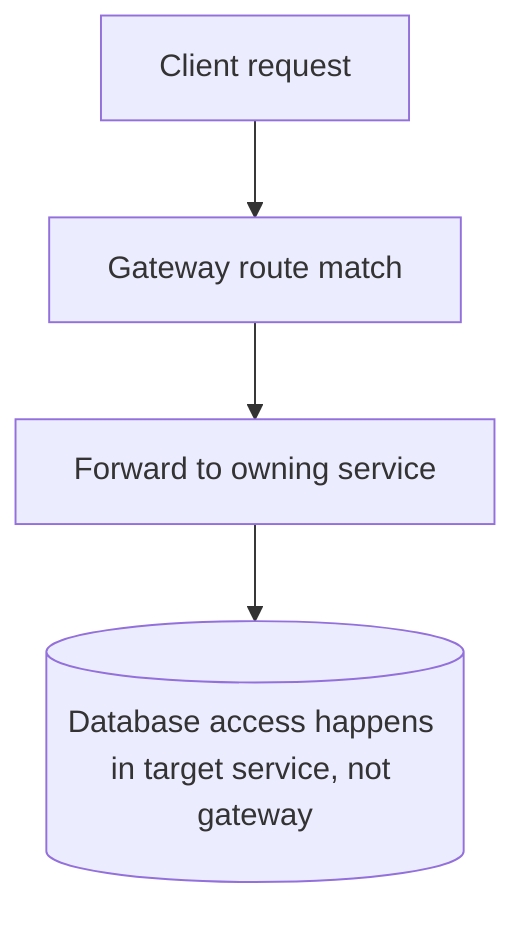

# Gateway Service Database Map

Last updated: 2026-04-20

## Role

Gateway services are routing layers and do not own or directly query the application database.

Implementations:

- Python gateway (`services/gateway/`)
- nginx gateway (`gateway/nginx.conf`)

## Database Relationship

## Change Impact

- Routing changes can indirectly affect which service hits which tables.
- Keep Python and nginx route tables aligned so DB ownership paths remain correct.

