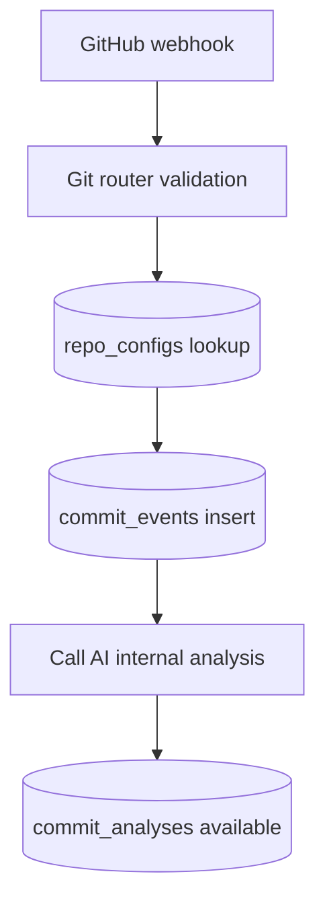

# Git Service Database Map

Last updated: 2026-04-20

## Role

Git service owns GitHub integration persistence and commit ingestion workflows.

## Primary Tables

- `github_accounts`
- `repo_configs`
- `commit_events`
- `commit_analyses`
- `audit_log` (selected events)

## Data Flow Summary

## Change Impact

- Webhook secret/signature changes affect repo configuration and validation flow.
- Commit analysis contract changes require AI/Git coordination.
- Reporting endpoints depend on stable joins between `commit_events` and `commit_analyses`.

