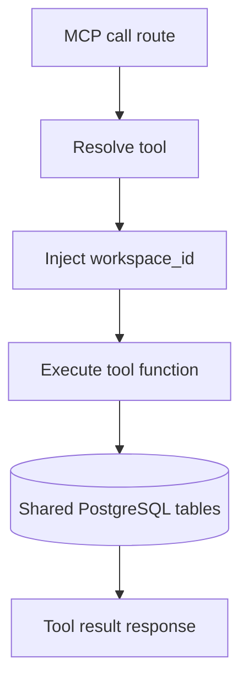

# MCP Service Database Map

Last updated: 2026-04-20

## Role

MCP service does not own a dedicated table domain.  
It executes workspace-scoped tools that may read/write shared business tables depending on selected tool.

## Database Interaction Model

- Entry routes: tool list and tool call
- Tool call injects `workspace_id`
- Tool implementation decides which shared tables are accessed

## Data Flow Summary

## Change Impact

- Any tool registry expansion may widen DB touchpoints.
- Workspace scoping in tool execution is critical for tenancy safety.
- Tool-level table usage should be documented when introducing new tools.

