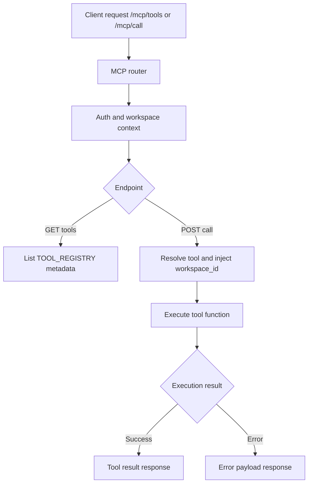

# Automation Service Feature Inventory

Last updated: 2026-04-20

## Scope

MCP HTTP wrapper service for workspace-scoped tool discovery and tool execution.

Primary code roots:

- `services/automation/main.py`
- `services/automation/domains/registry/router.py`
- `services/automation/domains/execution/`

## Current Feature Ownership

| Feature group | Routes | Main files | Canonical feature doc |
|---|---|---|---|
| Tool discovery | `GET /api/v1/workspaces/{workspace_id}/mcp/tools` | `routers/v1/mcp.py` | [`features/mcp/mcp-tools.md`](../../features/mcp/mcp-tools.md) |
| Tool execution | `POST /api/v1/workspaces/{workspace_id}/mcp/call` | `routers/v1/mcp.py` | [`features/mcp/mcp-tools.md`](../../features/mcp/mcp-tools.md) |

## Runtime Behavior

- Requires authenticated user and workspace context.
- Injects current `workspace_id` into tool parameters before execution.
- Returns structured success or error payload.

## Service Flowchart

## Dependencies

- `shared/auth.py` for user and workspace membership checks
- MCP tool registry and tool implementations
- Shared DB access through tool functions

## Change Impact Checklist

- Tool registry changes -> update tool metadata contracts and integration docs.
- Request/response shape changes -> update `docs/API-REFERENCE.md`.
- Workspace scoping changes -> re-verify auth and tenancy boundaries.

