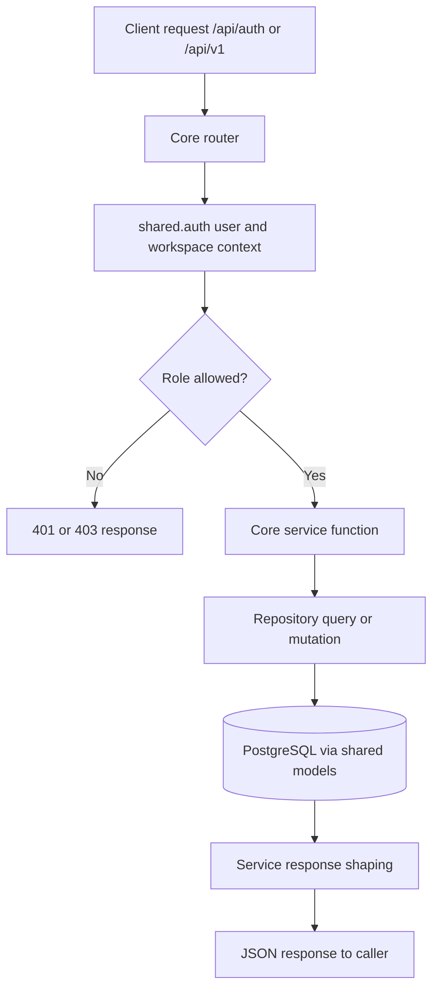

# Core Service Feature Inventory

Last updated: 2026-04-20

## Scope

Main business service mounted through `/api/auth/*` and `/api/v1/*` (default API owner when route is not explicitly AI/Git/MCP).

Primary code roots:

- `services/core/main.py`
- `services/core/routers/auth.py`
- `services/core/routers/v1/`
- `services/core/services/`
- `services/core/repositories/`

## Current Feature Ownership

| Domain | Routes (examples) | Main files |
|---|---|---|
| Auth & profile | `/api/auth/login`, `/signup`, `/refresh`, `/signout`, `/me`, `/profile` | `routers/auth.py`, `services/auth_service.py` |
| Workspace lifecycle | `/api/v1/workspaces` CRUD | `routers/v1/workspaces.py`, `services/workspace_service.py` |
| Membership & invites | `/members`, `/invites`, `/invites/accept`, `/invites/preview/{token}` | `routers/v1/workspaces.py`, `services/workspace_service.py` |
| Member skills | `/members/{member_id}/skills` | `routers/v1/workspaces.py`, `services/workspace_service.py` |
| Projects | `/projects` CRUD + project members | `routers/v1/projects.py`, `services/project_service.py` |
| Tasks & reports | `/tasks` CRUD + report create/approve/delete | `routers/v1/tasks.py`, `services/task_service.py` |
| OPPM planning | `/oppm/*` objectives/sub-objectives/timeline/costs/risks/deliverables/forecasts/import/export/spreadsheet/header/task-items | `routers/v1/oppm.py`, `services/oppm_service.py`, `services/export_service.py` |
| Agile workflows | `/epics`, `/user-stories`, `/sprints`, retrospective, burndown | `routers/v1/agile.py`, `services/agile_service.py` |
| Waterfall workflows | `/phases`, phase approvals, phase documents | `routers/v1/waterfall.py`, `services/waterfall_service.py` |
| Notifications | `/api/v1/notifications*` | `routers/v1/notifications.py`, `services/notification_service.py` |
| Dashboard | `/api/v1/workspaces/{workspace_id}/dashboard/stats` | `routers/v1/dashboard.py`, `services/dashboard_service.py` |

## Service Flowchart

## Data Touchpoints

Core writes or reads most business tables:

- identity/auth: `users`, `refresh_tokens`
- workspace: `workspaces`, `workspace_members`, `workspace_invites`, `member_skills`
- project/task execution: `projects`, `project_members`, `tasks`, `task_reports`, dependencies and ownership tables
- OPPM planning: objectives, timeline, costs, risks, deliverables, forecasts, spreadsheet/header/task-item tables
- support: `notifications`, `audit_log`

Canonical schema reference: `docs/DATABASE-SCHEMA.md`.

## Dependencies

- Shared auth and tenancy checks in `shared/auth.py`
- Shared ORM models and DB sessions from `shared/`
- Redis for token blacklist/rate-limit support

## Change Impact Checklist

- Any auth or role change -> verify `shared/auth.py` and workspace role gates.
- Any route shape change -> update `docs/API-REFERENCE.md`.
- Any OPPM/task/project behavior change -> update `docs/FLOWCHARTS.md` and `docs/AI-SYSTEM-CONTEXT.md`.
- Any schema change -> migration + `docs/DATABASE-SCHEMA.md` + `docs/ERD.md`.

