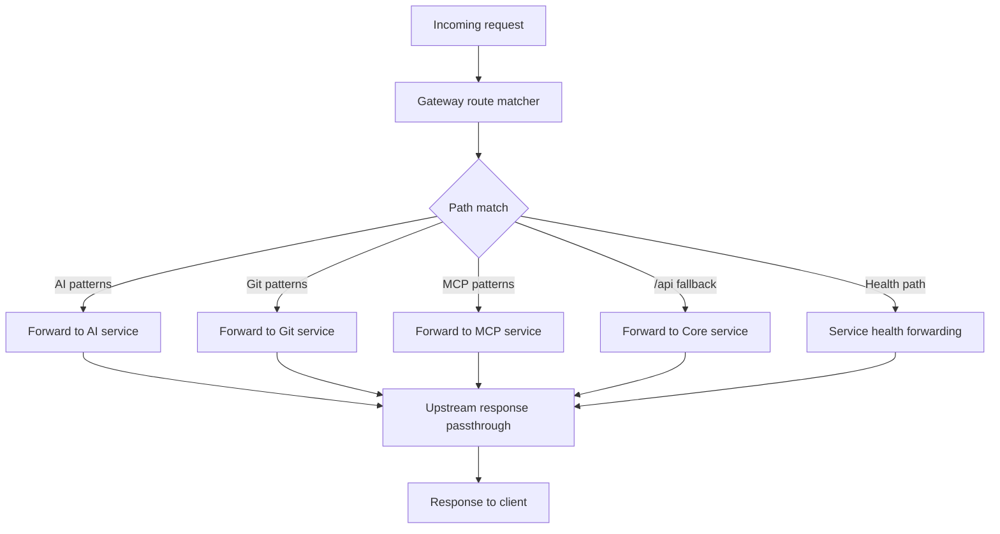

# Gateway Service Feature Inventory

Last updated: 2026-04-20

## Scope

Gateway layer has two implementations that must remain aligned:

1. Python gateway (`services/gateway/`) for native development and health-aware routing
2. nginx gateway (`gateway/nginx.conf`) for containerized routing

## Current Routing Ownership

| Route pattern | Target service |
|---|---|
| `/api/v1/workspaces/{ws}/projects/{project_id}/ai/*` | AI |
| `/api/v1/workspaces/{ws}/rag/*` | AI |
| `/api/v1/workspaces/{ws}/ai/*` | AI |
| `/internal/analyze-commits` | AI |
| `/api/v1/workspaces/{ws}/mcp/*` | MCP |
| `/api/v1/workspaces/{ws}/github-accounts*` | Git |
| `/api/v1/workspaces/{ws}/commits*` | Git |
| `/api/v1/workspaces/{ws}/git/*` | Git |
| `/api/v1/git/webhook` | Git |
| `/api/*` (fallback) | Core |

## Service Flowchart

## Runtime Responsibilities

- route matching and forwarding
- timeout policy by route class
- health-aware load balancing (Python gateway)
- response header forwarding (including multi-value headers)
- CORS handling for local development

## Dependencies

- Upstream service URLs from env settings
- Route-table parity between Python and nginx implementations

## Change Impact Checklist

- Any new service route family -> update **both** `services/gateway/main.py` and `gateway/nginx.conf`.
- Timeout policy changes -> update both gateways and note in architecture docs.
- Internal service-to-service paths (for example AI internal routes) -> verify gateway forwarding still supports expected deployment mode.

