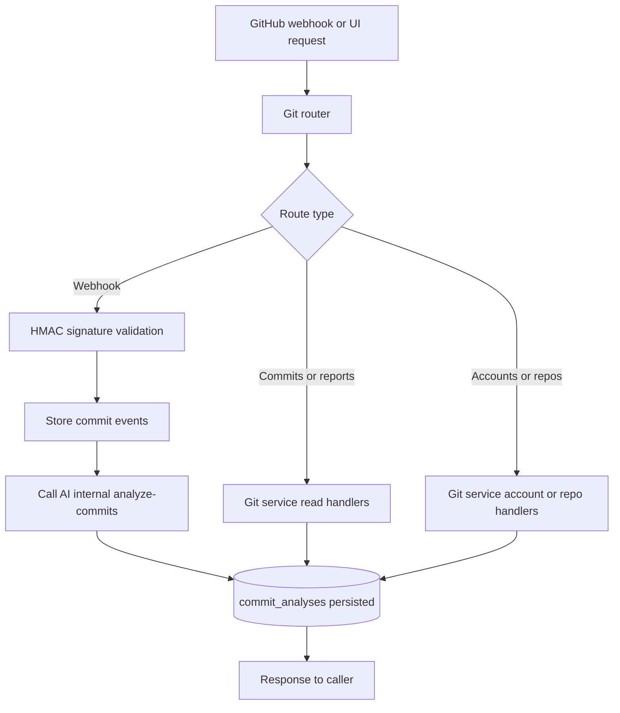

# Git Service Feature Inventory

Last updated: 2026-04-20

## Scope

GitHub integration service mounted through `/api/v1/workspaces/*/github-accounts*`, `/git/*`, `/commits*`, plus webhook endpoint `/api/v1/git/webhook`.

Primary code roots:

- `services/git/main.py`
- `services/git/routers/v1/git.py`
- `services/git/services/git_service.py`
- `services/git/repositories/`

## Current Feature Ownership

| Feature group | Routes (examples) | Main files |
|---|---|---|
| GitHub accounts | `/workspaces/{workspace_id}/github-accounts` | `routers/v1/git.py`, `services/git_service.py` |
| Repo configuration | `/workspaces/{workspace_id}/git/repos*` | `routers/v1/git.py`, `services/git_service.py` |
| Commit read/reporting | `/workspaces/{workspace_id}/commits`, `/git/report/{project_id}`, `/git/recent-analyses` | `routers/v1/git.py`, `services/git_service.py` |
| Webhook ingestion | `/api/v1/git/webhook` | `routers/v1/git.py`, `services/git_service.py` |

## Runtime Flow

1. GitHub sends push webhook.
2. Service validates HMAC signature (`X-Hub-Signature-256`).
3. Service returns fast accepted response.
4. Background task stores commit events.
5. Service calls AI internal endpoint `/internal/analyze-commits` with `X-Internal-API-Key`.
6. Commit analysis becomes available in read endpoints.

## Service Flowchart

## Data Touchpoints

- `github_accounts`
- `repo_configs`
- `commit_events`
- `commit_analyses`
- `audit_log`

## Dependencies

- GitHub webhook/event model
- AI service internal analysis endpoint
- Shared DB and shared auth utilities

## Change Impact Checklist

- Webhook payload/signature logic changes -> update security and flow docs.
- AI handoff payload/header changes -> update AI internal route contract and gateway routing notes.
- Repo/account response changes -> update `docs/API-REFERENCE.md`.

