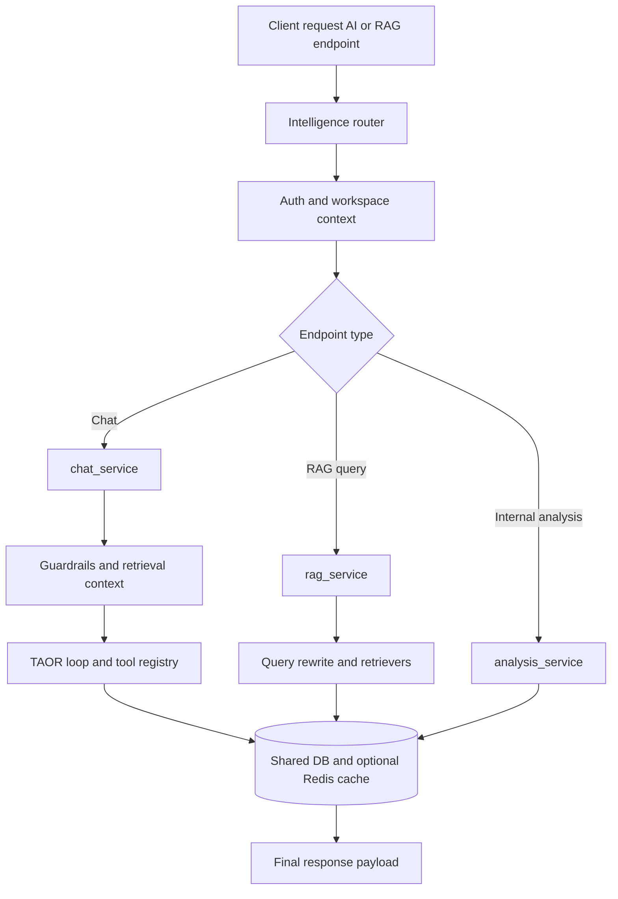

# Intelligence Service Feature Inventory

Last updated: 2026-04-20

## Scope

Intelligence microservice mounted through `/api/v1/workspaces/*/ai*`, `/api/v1/workspaces/*/rag*`, and internal `/internal/analyze-commits`.

Primary code roots:

- `services/intelligence/main.py`
- `services/intelligence/domains/models/router.py`
- `services/intelligence/domains/chat/router.py`
- `services/intelligence/domains/rag/router.py`
- `services/intelligence/domains/analysis/internal_router.py`
- `services/intelligence/domains/chat/service.py`
- `services/intelligence/domains/rag/service.py`
- `services/intelligence/domains/analysis/service.py`
- `services/intelligence/infrastructure/rag/`
- `services/intelligence/infrastructure/tools/`
- `services/intelligence/infrastructure/llm/`

## Current Feature Ownership

| Feature group | Routes (examples) | Main files | Canonical feature doc |
|---|---|---|---|
| AI model configuration | `/workspaces/{workspace_id}/ai/models*` | `domains/models/router.py` | [`features/ai/ai-assistant.md`](../../features/ai/ai-assistant.md) |
| Workspace chat | `/workspaces/{workspace_id}/ai/chat` | `domains/chat/router.py`, `domains/chat/service.py` | [`features/ai/ai-assistant.md`](../../features/ai/ai-assistant.md) |
| Project chat | `/workspaces/{workspace_id}/projects/{project_id}/ai/chat` (+ stream) | `domains/chat/router.py`, `domains/chat/service.py` | [`features/ai/ai-assistant.md`](../../features/ai/ai-assistant.md) |
| Plan suggestion/commit | `/ai/suggest-plan`, `/ai/suggest-plan/commit` | `domains/chat/router.py`, `domains/chat/service.py` | [`features/ai/ai-assistant.md`](../../features/ai/ai-assistant.md) |
| Weekly summary | `/ai/weekly-summary` | `domains/chat/router.py`, `domains/chat/service.py` | [`features/ai/ai-assistant.md`](../../features/ai/ai-assistant.md) |
| Reindex + capabilities | `/ai/reindex`, `/ai/chat/capabilities` | `domains/chat/router.py`, `domains/document_indexer/service.py` | [`features/ai/ai-assistant.md`](../../features/ai/ai-assistant.md) |
| File parsing & OPPM extraction/fill | `/ai/parse-file`, `/ai/oppm-extract`, `/ai/oppm-fill` | `domains/models/router.py`, `domains/analysis/oppm_fill_router.py`, `infrastructure/file_parser.py` | [`features/oppm/ai-fill-and-extract.md`](../../features/oppm/ai-fill-and-extract.md) |
| RAG query API | `/workspaces/{workspace_id}/rag/query` | `domains/rag/router.py`, `domains/rag/service.py` | [`features/ai/ai-assistant.md`](../../features/ai/ai-assistant.md) |
| Feedback logging | `/ai/feedback` (workspace/project) | `domains/chat/router.py` | [`features/ai/ai-assistant.md`](../../features/ai/ai-assistant.md) |
| Internal commit analysis | `/internal/analyze-commits` | `domains/analysis/internal_router.py`, `domains/analysis/service.py` | [`features/github/github-integration.md`](../../features/github/github-integration.md) |

## Service Flowchart

## Current RAG/Tooling Architecture

- TAOR loop with bounded iterations (max 7)
- input and output guardrails
- query rewriting
- parallel retrieval (vector/keyword/structured)
- reranking and project-context boost
- Redis semantic cache
- tool registry (24 tools across oppm/task/cost/read/project)
- multi-provider adapters (OpenAI, Anthropic, Ollama, Kimi)

Detailed refs:

- `docs/ai/AI-PIPELINE-REFERENCE.md`
- `docs/ai/TOOL-REGISTRY-REFERENCE.md`

## AI Evolution Options (for future upgrades)

**See also:** Detailed feasibility analysis in `GRAPH-FEASIBILITY.md` and migration roadmap in `GRAPH-MIGRATION-PATHS.md`

### Option A: Graph API as orchestration layer

Use a graph-based orchestration API for conversation/tool pipelines while keeping existing repository/tool boundaries.

Best when:

- you want stronger stateful orchestration without replacing all retrieval logic
- you need pluggable multi-step execution graphs per query type

Primary impact:

- chat orchestration and tool-call pipeline
- limited API contract shifts

**Feasibility:** ⭐⭐⭐⭐ High | Effort: Medium | Business Impact: Low-Medium
**Recommendation:** Consider after GraphRAG succeeds (non-blocking)

### Option B: GraphRAG replacement

Replace current retrieval stages with graph-native retrieval over entity/relationship graphs.

Best when:

- relationship reasoning is the dominant use case
- vector+keyword retrieval misses dependency/context chains

Primary impact:

- indexing model, retrieval strategy, scoring logic, source/citation shape
- higher migration cost and schema/index changes likely

**Feasibility:** ⭐⭐⭐⭐ High | Effort: Medium-Large | Business Impact: **High**
**Recommendation:** ⭐ Pilot immediately (GraphRAG Hybrid, 4 weeks)

### Option C: Hybrid current RAG + GraphRAG

Keep current retrievers and add graph retrieval as an additional retriever/reranker signal.

Best when:

- you want low-risk incremental rollout
- you need measurable quality gains before full migration

Primary impact:

- add new retriever branch and fusion logic
- minimal disruption to existing API shape

**Feasibility:** ⭐⭐⭐⭐ High | Effort: Medium | Business Impact: High
**Recommendation:** ⭐ **Start here** — pilot path documented in GRAPH-MIGRATION-PATHS.md

### Option D: Graph Database (Neo4j, TigerGraph)

Migrate relationship/entity data to graph-native store alongside PostgreSQL.

Best when:

- deep relationship traversals (4+ hops) become common
- dual-system operational overhead is acceptable

Primary impact:

- new infrastructure, operational complexity
- improved query expressiveness for relationship patterns

**Feasibility:** ⭐⭐⭐ Medium | Effort: Large | Business Impact: Medium
**Recommendation:** Defer — revisit after GraphRAG pilot demonstrates need

## Data Touchpoints

- `ai_models`
- `document_embeddings`
- `audit_log` (feedback/traceability)
- read/write access to shared business tables through AI repositories/tools

## Change Impact Checklist

- Chat/RAG behavior change -> update `docs/FLOWCHARTS.md`, `docs/ARCHITECTURE.md`, and AI docs.
- Tool contracts change -> update `docs/ai/TOOL-REGISTRY-REFERENCE.md` and API docs.
- Retrieval/index shape change -> update schema docs if tables/indexes change.
- Internal analysis contract change -> coordinate with Integrations service `trigger_ai_analysis` payload/headers.

