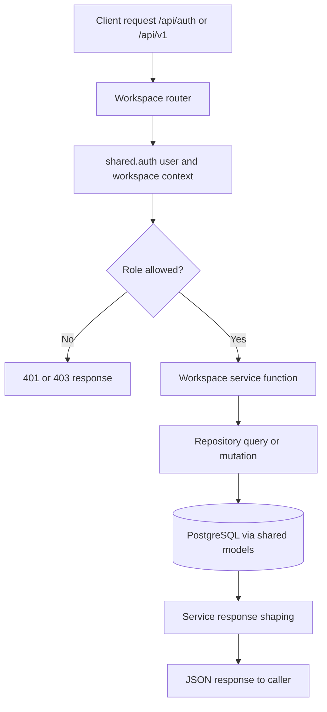

# Workspace Service Feature Inventory

Last updated: 2026-04-20

## Scope

Main business monolith mounted through `/api/auth/*` and `/api/v1/*`.

Primary code roots:

- `services/workspace/main.py`
- `services/workspace/domains/auth/router.py`
- `services/workspace/domains/workspace/router.py`
- `services/workspace/domains/project/router.py`
- `services/workspace/domains/task/router.py`
- `services/workspace/domains/oppm/router.py`
- `services/workspace/domains/agile/router.py`
- `services/workspace/domains/waterfall/router.py`
- `services/workspace/domains/notification/router.py`
- `services/workspace/domains/dashboard/router.py`
- `services/workspace/domains/member/router.py`

## Current Feature Ownership

| Domain | Routes (examples) | Main files | Canonical feature doc |
|---|---|---|---|
| Auth & profile | `/api/auth/login`, `/signup`, `/refresh`, `/signout`, `/me`, `/profile` | `domains/auth/router.py`, `domains/auth/service.py` | [`features/auth/authentication.md`](../../features/auth/authentication.md) |
| Workspace lifecycle | `/api/v1/workspaces` CRUD | `domains/workspace/router.py`, `domains/workspace/service.py` | [`features/workspace/workspaces.md`](../../features/workspace/workspaces.md) |
| Membership & invites | `/members`, `/invites`, `/invites/accept`, `/invites/preview/{token}` | `domains/workspace/router.py`, `domains/workspace/service.py` | [`features/workspace/team-invites.md`](../../features/workspace/team-invites.md) |
| Member skills | `/members/{member_id}/skills` | `domains/member/router.py`, `domains/member/service.py` | [`features/workspace/team-invites.md`](../../features/workspace/team-invites.md) |
| Projects | `/projects` CRUD + project members | `domains/project/router.py`, `domains/project/service.py` | [`features/project/projects.md`](../../features/project/projects.md) |
| Tasks & reports | `/tasks` CRUD + report create/approve/delete | `domains/task/router.py`, `domains/task/service.py` | [`features/project/tasks.md`](../../features/project/tasks.md) |
| OPPM planning | `/oppm/*` objectives/sub-objectives/timeline/costs/risks/deliverables/forecasts/import/export/spreadsheet/header/task-items | `domains/oppm/router.py`, `domains/oppm/service.py`, `domains/workspace/export_service.py` | [`features/oppm/structured-planning.md`](../../features/oppm/structured-planning.md), [`features/oppm/spreadsheet-rendering.md`](../../features/oppm/spreadsheet-rendering.md) |
| Agile workflows | `/epics`, `/user-stories`, `/sprints`, retrospective, burndown | `domains/agile/router.py`, `domains/agile/service.py` | [`features/project/tasks.md`](../../features/project/tasks.md) |
| Waterfall workflows | `/phases`, phase approvals, phase documents | `domains/waterfall/router.py`, `domains/waterfall/service.py` | [`features/project/projects.md`](../../features/project/projects.md) |
| Notifications | `/api/v1/notifications*` | `domains/notification/router.py`, `domains/notification/service.py` | [`features/dashboard/dashboard-notifications.md`](../../features/dashboard/dashboard-notifications.md) |
| Dashboard | `/api/v1/workspaces/{workspace_id}/dashboard/stats` | `domains/dashboard/router.py`, `domains/dashboard/service.py` | [`features/dashboard/dashboard-notifications.md`](../../features/dashboard/dashboard-notifications.md) |

## Service Flowchart

## Data Touchpoints

Core writes or reads most business tables:

- identity/auth: `users`, `refresh_tokens`
- workspace: `workspaces`, `workspace_members`, `workspace_invites`, `member_skills`
- project/task execution: `projects`, `project_members`, `tasks`, `task_reports`, dependencies and ownership tables
- OPPM planning: objectives, timeline, costs, risks, deliverables, forecasts, spreadsheet/header/task-item tables
- support: `notifications`, `audit_log`

Canonical schema reference: `docs/database/schema.md`.

## Dependencies

- Shared auth and tenancy checks in `shared/auth.py`
- Shared ORM models and DB sessions from `shared/`
- Redis for token blacklist/rate-limit support

## Change Impact Checklist

- Any auth or role change -> verify `shared/auth.py` and workspace role gates.
- Any route shape change -> update `docs/API-REFERENCE.md`.
- Any OPPM/task/project behavior change -> update `docs/FLOWCHARTS.md` and `docs/AI-SYSTEM-CONTEXT.md`.
- Any schema change -> migration + `docs/database/schema.md` + `docs/database/ER-DIAGRAM.md`.

